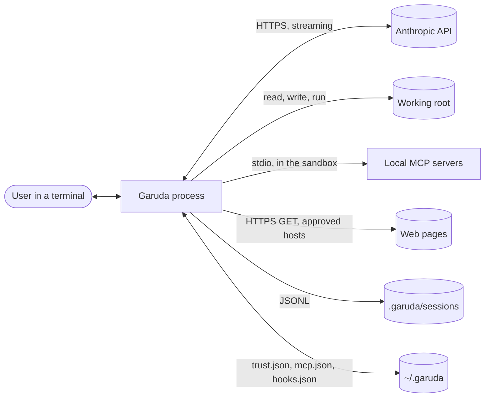
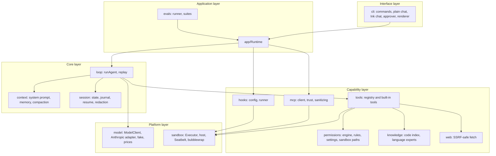
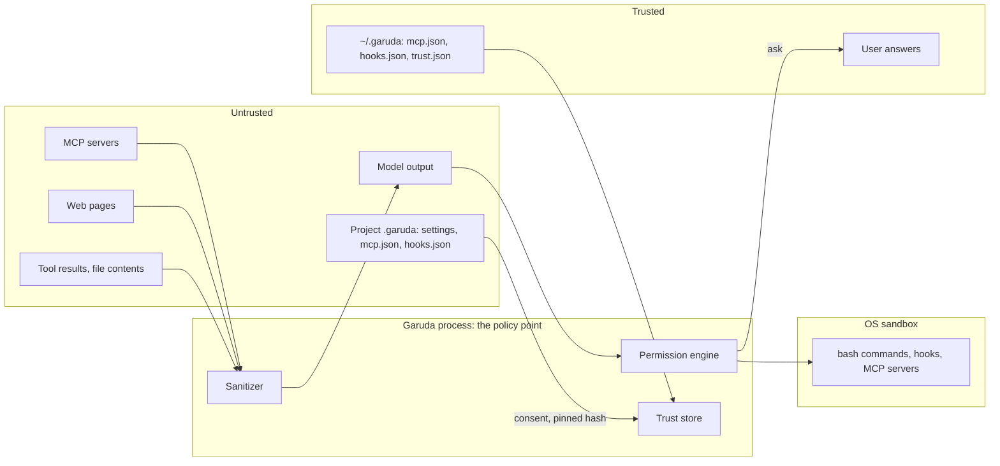

# Architecture

Version 0.2.1. This document describes the parts of Garuda, their dependencies, the trust
boundaries, and the main decisions.

## 1. Context

Garuda runs in a terminal, in one project folder (the *working root*). It sends the conversation to a
Claude model, runs the tools that the model asks for, and shows the result. The user approves every
action that can change something, unless a sandbox or a rule makes the action safe.

## 2. Goals and constraints

| ID | Goal | How the architecture meets it |
| --- | --- | --- |
| N1 | One model adapter | Only `src/model/anthropic.ts` imports the Anthropic SDK. The loop sees the `ModelClient` interface. |
| N2 | Prompt caching | The system prompt and the tool list stay the same bytes for a whole session. Cache breakpoints on the system prompt, the last tool and the last message. |
| N3 | Start in less than 1 s | Heavy modules load with `import()` on first use: the SDK, inquirer, Ink and React, TypeScript 6, the MCP SDK, the HTML converter. `--version` takes about 240 ms. |
| N4 | Testable without the network | `FakeModelClient` plays a script. 245 tests run with no API calls. |
| N5 | Measured quality | `garuda eval` runs fixed tasks in scratch folders and reports pass rate, steps, tokens and cost. |
| N6 | No secrets on disk | Session files pass through a redactor. Trust and session files are private (0600). |
| N8 | One place starts processes | Only `src/sandbox/` starts processes. A test and a Biome rule enforce this. |

Other constraints: a single binary is possible (Node SEA), so Garuda uses no native add-ons; grep is
written in TypeScript; the code index uses TypeScript 6 (the last compiler written in JavaScript).

## 3. Layers and components

| Component | Folder | Responsibility |
| --- | --- | --- |
| CLI | `src/cli/` | Parse the command line; run one task (`-p`), a chat (plain or Ink), `--resume`, `--replay` or `eval`. Ask the user for approvals. Show events. |
| Runtime | `src/app/` | Build everything one Garuda process needs from settings: executor, permission engine, tools, system prompt, session, MCP servers, hooks. Run one turn. |
| Agent loop | `src/loop/` | Call the model, run the tool calls, repeat until the model stops or a limit hits. Replay a recorded session. |
| Model | `src/model/` | The `ModelClient` interface, the Anthropic adapter, the fake model, prices and context windows. |
| Tools | `src/tools/` | The tool interface, the registry (validation, hooks, permission check, run), and the built-in tools. |
| Permissions | `src/permissions/` | Decide per call: allow, deny or ask. Rules, settings, path guard, sensitive files, sandbox paths. |
| Sandbox | `src/sandbox/` | The `Executor`: run a command or start a long-running process, on the host or in an OS sandbox. |
| Session | `src/session/` | The conversation in memory, the JSONL journal, resume, redaction, read tracking. |
| Context | `src/context/` | System prompt, `GARUDA.md` instructions, project memory, compaction. |
| Knowledge | `src/knowledge/` | Local code index: symbols, references, a code graph. No model call. |
| MCP | `src/mcp/` | Start MCP servers in the sandbox, consent and pinning, tool adapters, text cleaning. |
| Web | `src/web/` | Fetch one page with SSRF protection and turn HTML into Markdown. |
| Hooks | `src/hooks/` | Run the user's commands before and after tool calls. |
| Evals | `src/evals/` | Eval tasks, the generated "shopkit" repository, the runner and the report. |

## 4. Dependency rules

The rules keep the core independent of the interface, and keep risky code in one place. Tests in
`test/architecture.test.ts` enforce them.

1. The loop, the app, the evals, the context and the session never import the CLI.
2. Only `src/model/anthropic.ts` imports `@anthropic-ai/*` (N1).
3. Only `src/sandbox/` imports `child_process` (N8). Biome also blocks it.
4. Only `src/mcp/` imports `@modelcontextprotocol/*`, and never its stdio transport: MCP servers start
   through the Executor.
5. Only `src/cli/chat/ui.tsx` and `src/cli/chat/inkChat.ts` import Ink or React.
6. The CLI and the app load no heavy module at startup: the SDK, inquirer, the MCP manager and TypeScript 6
   load with `import()` (N3).

## 5. Trust boundaries

Garuda treats the model output, file contents, tool results, MCP servers, web pages and project
configuration as untrusted. The user and the user's own files in `~/.garuda` are trusted.

| Boundary | Threat | Control |
| --- | --- | --- |
| Model → tools | A prompt injection makes the model do harm. | Permission engine: read-only tools run; writes, commands outside the sandbox, MCP calls and new web hosts ask. Deny rules always win. |
| Commands → machine | A command deletes or leaks data. | OS sandbox: writes only in the root, temp and caches; home secrets unreadable; no network. Escape asks. |
| Project config → Garuda | A cloned repo starts code (MCP servers, hooks). | Consent with the full command; answer pinned to a hash in `~/.garuda/trust.json`; changes ask again. |
| MCP server / web page → model | Hidden instructions, terminal escape codes, fake markers. | Clean text, cap its size, wrap it in `<mcp_result>` / `<web_result>`, neutralize Garuda's own markers, mark it as untrusted in the prompt. |
| web_fetch → network | Server-side request forgery; data leaks through URLs. | Only public addresses, checked on the resolved IP and pinned; each redirect hop checked; new hosts ask; unusual URLs always ask. |
| Garuda → disk | Secrets in session logs. | Redactor on every journal line; files 0600. |

## 6. Data stores

All state is in files. There is no server and no database.

| File | Owner | Content |
| --- | --- | --- |
| `<root>/.garuda/sessions/<id>.jsonl` | Garuda | One record per line: start, user, assistant, tool results, compaction, end. 0600, redacted. |
| `<root>/.garuda/settings.json` | Project | Executor, permission rules, env allowlist, limits, model price, code index mode, web settings. |
| `<root>/.garuda/memory.md` | Project | Facts saved by the `remember` tool. Loaded into the next session. |
| `<root>/.garuda/mcp.json`, `hooks.json` | Project | Project MCP servers and hooks. Need consent. |
| `<root>/.garuda/index/code-graph.json` | Garuda | Code graph cache for the code index. |
| `<root>/GARUDA.md` | Project | Instructions for the agent. |
| `~/.garuda/mcp.json`, `hooks.json` | User | Trusted MCP servers and hooks. |
| `~/.garuda/trust.json` | Garuda | Consent hashes for project MCP servers and hooks; tool-list hashes. 0600. |

`SessionStore` is an interface, so a shared store (for example Redis) can replace the files later.

## 7. Main decisions

| Decision | Choice | Reason |
| --- | --- | --- |
| Language | TypeScript on Node | The MCP and Anthropic SDKs are first-class; one binary with Node SEA. |
| Isolation | Approvals in 0.1; OS sandbox (Seatbelt, bubblewrap) in 0.2 behind the `Executor` | Real isolation without containers; the loop and tools did not change. |
| Sandbox scope | Writes only; reads everywhere except secrets; no network | Toolchains keep working; data cannot leave. |
| Approvals in the sandbox | Commands in the sandbox need no approval | The sandbox is the control; approvals stay for escapes and writes. |
| Code index | Off for the model by default | An A/B test with 3 runs per task showed no gain in steps or cost. The index stays for the user (`/where`, `/refs`, `/map`). |
| MCP | stdio only, in the sandbox, consent for project servers | HTTP with OAuth is a large surface; it comes as its own step. |
| Hooks | Block only; fail closed | A hook must never approve or let a call through by accident. |
| Chat UI | Ink, loaded only for a chat on a terminal | Rich UI without slowing `-p`, pipes and evals. |
| Sessions | JSONL files behind `SessionStore` | Simple, readable, append-only; replaceable later. |
