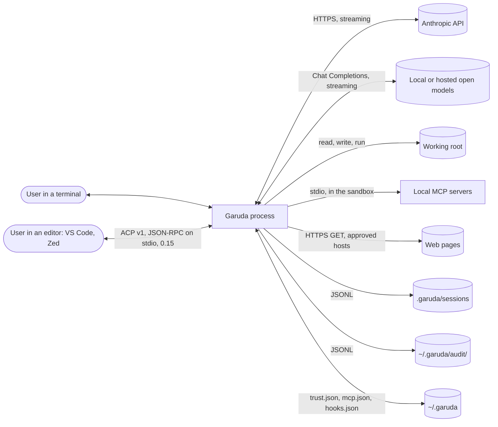
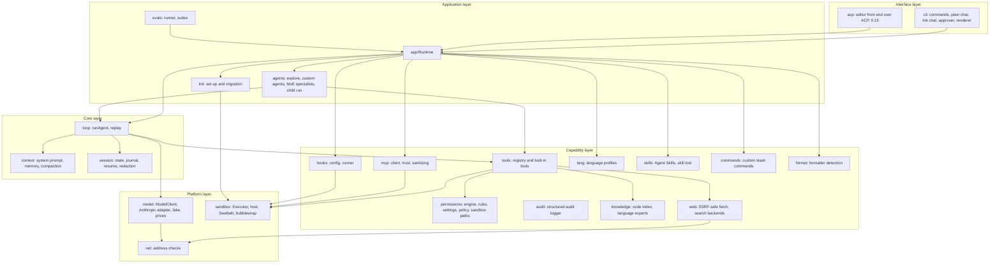
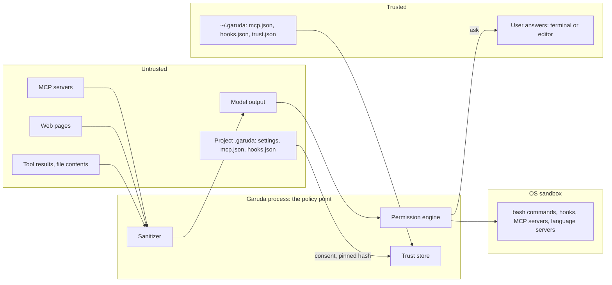

# Architecture

Version 0.15.0 (editors over ACP, on top of 0.14.1: the 0.14–0.17 branches after the merge gate and Garuda's own review of nine areas). This document describes the parts of Garuda, their dependencies, the trust
boundaries, and the main decisions.

## 1. Context

Garuda runs in a terminal, in one project folder (the *working root*). It sends the conversation to a
Claude model, runs the tools that the model asks for, and shows the result. The user approves every
action that can change something, unless a sandbox or a rule makes the action safe.

## 2. Goals and constraints

| ID | Goal | How the architecture meets it |
| --- | --- | --- |
| N1 | Provider-neutral model access | The loop sees only the `ModelClient` interface. `anthropic.ts` (the only module with the Anthropic SDK) and `openaiCompatible.ts` (plain fetch) are the adapters. |
| N2 | Prompt caching | The system prompt and the tool list stay the same bytes for a whole session. Cache breakpoints on the system prompt, the last tool and the last message. |
| N3 | Start in less than 1 s | Heavy modules load with `import()` on first use: the SDK, inquirer, Ink and React, TypeScript 6, the MCP SDK, the HTML converter. `--version` takes about 240 ms. |
| N4 | Testable without the network | `FakeModelClient` plays a script. More than 450 tests run with no API calls (459 at 0.5.0, 538 at 0.7.0, 552 at 0.8.0, 571 at 0.9.0, 577 at 0.10.0, 589 at 0.11.0, 603 at 0.12.0, 621 at 0.13.0; 804 at 0.14.0: 797 pass, 1 open-gap expected failure, 6 skipped on Linux; 837 at 0.14.1: 830 pass, 1 open-gap expected failure, 6 skipped on Linux; 862 at 0.15.0: 855 pass, 1 open-gap expected failure, 6 skipped on Linux). |
| N5 | Measured quality | `garuda eval` runs fixed tasks in scratch folders and reports pass rate, steps, tokens and cost. |
| N6 | No secrets on disk | Session files pass through a redactor. Trust and session files are private (0600). |
| N8 | One place starts processes | Only `src/sandbox/` starts processes. A test and a Biome rule enforce this. The user's own editor (Ctrl-G, 0.6) runs on the real terminal through `src/sandbox/terminal.ts`, never through a tool. |

Other constraints: a single binary is possible (Node SEA), so Garuda uses no native add-ons; grep is
written in TypeScript; the code index uses TypeScript 6 (the last compiler written in JavaScript).

## 3. Layers and components

| Component | Folder | Responsibility |
| --- | --- | --- |
| CLI | `src/cli/` | Parse the command line; run one task (`-p`), a chat (plain or Ink), `--resume`, `--replay` or `eval`. Ask the user for approvals. Show events. Chat input (0.6): Esc, multi-line, `$EDITOR`, `@path`, `!command`, Tab completion; `/sessions`, `/models`, `/export`, `/diff`; notifications that respect the window focus. 0.8: `/compact`, `/sessions rename` and `delete`, `/plan <task>`, Tab for command arguments, a fuzzy `@` search. 0.9: `/details`, `/thinking`, the command palette (Ctrl-P); after Ctrl-C the model learns that the user stopped the task. |
| ACP (0.15) | `src/acp/`, `src/cli/acpCommand.ts` | `garuda acp`: Garuda as an agent for editors that speak the Agent Client Protocol. One runtime per editor session; maps the runtime's events to `session/update` and its approval questions to `session/request_permission`. See [acp.md](lld/acp.md). |
| Runtime | `src/app/` | Build everything one Garuda process needs from settings: executor, permission engine, tools, system prompt, session, MCP servers, hooks. Run one turn; attach `@path` files to the prompt (0.6); run the user's `!command`; switch the session or the model from the chat (0.6). |
| Agent loop | `src/loop/` | Call the model, run the tool calls, repeat until the model stops or a limit hits. Replay a recorded session. |
| Model | `src/model/` | The `ModelClient` interface, providers and model specs, the Anthropic and OpenAI-compatible adapters, the fake model, prices and context windows. Server tools (0.6): Claude's web search runs inside the reply; its blocks go back unchanged; so do thinking blocks (0.9). The Batch API (0.7): a batch-of-one client at half the token price, and the `DeadlineClient` that moves a job to the normal API at its switch time or after a slow step. |
| Tools | `src/tools/` | The tool interface, the registry (validation, hooks, permission check, run), and the built-in tools. |
| Permissions | `src/permissions/` | Decide per call: allow, deny or ask. Rules, settings, path guard, sensitive files, sandbox paths. |
| Sandbox | `src/sandbox/` | The `Executor`: run a command or start a long-running process, on the host or in an OS sandbox. |
| Session | `src/session/` | The conversation in memory, the JSONL journal, resume, redaction, read tracking, the session list (0.6), titles and delete (0.8). |
| Context | `src/context/` | System prompt, instruction files (`AGENTS.md`, `CLAUDE.md`, `GARUDA.md`), project memory, compaction. |
| Commands | `src/commands/` | Custom slash commands: load, expand, consent for project commands. |
| Agents | `src/agents/` | Child runs: the explore subagent (0.3), custom agents (0.5, Claude Code's format, the `agent` tool), and Mixture-of-Experts language specialists (0.17, Go, Rust, Python, Java, TypeScript via `delegate_expert`). |
| Skills | `src/skills/` | Load Agent Skills folders (Garuda's and Claude Code's); the `skill` tool; consent for project skills; `/name`. |
| Undo | `src/undo/` | Snapshots of the project before each turn in a git store of Garuda's own; `/undo` and `/redo`. |
| Init | `src/init/` | `garuda init` and `/init`: read other agents' files (read only), write new Garuda files after one yes, offer `git init`, give the prompt of the init turn. |
| Format | `src/format/` | The project's formatter after edits (0.10): detect it from config files and binaries; the runtime runs it in the sandbox. |
| LSP | `src/lsp/` | Language servers in the sandbox: find, install, start; errors of a changed file after an edit. |
| Knowledge | `src/knowledge/` | Local multi-language code index and dynamic plugin system (TS/JS, Python, Java, Go, Rust, user plugins; project plugins are not loaded): symbols, references, call graph, blast radius & impact analysis, AST queries. No model call. |
| MCP | `src/mcp/` | Start local MCP servers in the sandbox, connect to remote ones (Streamable HTTP, OAuth), consent and pinning, tool adapters, text cleaning. |
| Web | `src/web/` | Fetch one page with SSRF protection and turn HTML into Markdown; web search through the user's backend (0.5); the config of Claude's search (0.6). |
| Net | `src/net/` | Address checks (public, loopback) shared by web fetch and model providers. |
| Hooks | `src/hooks/` | Run the user's commands before and after tool calls. |
| Subagents | `src/agents/` | Child agent execution (`child.ts`): explore (0.3), custom agents (0.5), and MoE specialists (0.17) with isolated sessions, limits, reports, and `/experts`. |
| Language profiles | `src/lang/` | Find the build tool from marker files (Maven, Gradle, Python): test commands, prompt notes, package caches for the sandbox. |
| Jobs | `src/jobs/` | Scheduled jobs (0.7): the job file, the base commit and worktree on a job branch, the commit and the report. `garuda run` in the CLI runs a job with its approval list and an engine that denies instead of asking. The launchd agent (macOS) starts a job with nobody at the terminal; a job may use the Batch API until its finish-by time. Proof of work (0.11): tests before and after, risk flags, a principal-engineer review, a verdict. The night shift (0.11): a queue per project, `garuda night` runs it (up to 3 at a time) and writes one digest. |
| Evals | `src/evals/` | Eval tasks (Node, Java, Python), the generated "shopkit" repository, the repo suite from the project's git history (0.12), toolchain checks, the runner and the report. |

## 4. Dependency rules

The rules keep the core independent of the interface, and keep risky code in one place. Tests in
`test/architecture.test.ts` enforce them.

1. The loop, the app, the agents, the evals, the context and the session never import the CLI.
2. Only `src/model/anthropic.ts` imports `@anthropic-ai/*` (N1). It also imports `undici` (0.14), for a
   fetch that lets a stream stay quiet for up to 20 minutes while the model thinks.
3. Only `src/sandbox/` imports `child_process` (N8). Biome also blocks it.
4. Only `src/mcp/` imports `@modelcontextprotocol/*`, and never its stdio transport: MCP servers start
   through the Executor.
5. Only `src/cli/chat/ui.tsx` and `src/cli/chat/inkChat.ts` import Ink or React.
6. The CLI and the app load no heavy module at startup: the model adapters, inquirer, the MCP manager and
   TypeScript 6 load with `import()` (N3).
7. (0.15) Only `src/acp/` imports `@agentclientprotocol/*`, and only `garuda acp` loads it,
   with `import()`. The app, the loop and the CLI's other commands never import `src/acp/`. `src/acp/`
   never imports `child_process` and never writes to stdout itself: only the SDK writes protocol
   messages.

## 5. Trust boundaries

Garuda treats the model output, file contents, tool results, MCP servers, web pages and project
configuration as untrusted. The user and the user's own files in `~/.garuda` are trusted.

| Boundary | Threat | Control |
| --- | --- | --- |
| Editor → Garuda (ACP, 0.15) | The editor (or an extension in it) sends prompts and answers questions; it offers its own file and terminal access; it can start MCP servers for the agent; output on stdout breaks or fakes protocol messages. | The editor is the user's program, as the terminal is: it answers, Garuda enforces. Every tool call passes the same permission engine, OS sandbox, team policy, hooks and audit log. Garuda never uses the editor's `fs/*` or `terminal/*` methods, and does not start the editor's MCP servers (0.15). The question shows hidden characters, as in the terminal. Project settings that loosen safety apply only when already approved in a terminal. stdout carries only SDK messages; everything else goes to stderr. An editor that auto-approves answers "yes" for the user, but cannot pass a deny rule, the sandbox or the policy. |
| Model → tools | A prompt injection makes the model do harm. | Permission engine: read-only tools run; writes, commands outside the sandbox, MCP calls and new web hosts ask. Deny rules always win. The approval screen shows hidden characters (␍, ␛, [U+…]), so a carriage return in a command cannot hide what runs (0.14.1, review). |
| Commands → machine | A command deletes or leaks data. | OS sandbox: writes only in the root, temp and caches; home secrets unreadable; no network. Escape asks. On macOS a command cannot start apps through LaunchServices or Apple Events (they would run outside the sandbox); on Linux it has its own process space, so it does not see Garuda's or the user's processes (0.14, review). A command sees only allowlisted environment variables, and the model-provider API keys are taken out of Garuda's own process environment at startup (0.14, review), so a command cannot read them from `/proc/<pid>/environ` of the Garuda process either. |
| Project config → Garuda | A cloned repo starts code (MCP servers, hooks). | Consent with the full command; answer pinned to a hash in `~/.garuda/trust.json`; changes ask again. |
| Project settings → Garuda | A cloned repo's `.garuda/settings.json` turns off its own safety: `executor: "host"` with `allow: ["bash"]` ran every command on the host with no question; `sandbox.writePaths: ["~"]` made the home folder writable (found by Garuda's own review, 2026-10). | The parts that loosen safety (executor host, allow rules, writePaths, env.allow, web.allowLocalhost) apply only after a yes at startup, pinned to their hash; otherwise they are left out with a notice. Jobs use them only when pinned. Allow rules match the command as written (no `sudo`/`VAR=` prefix skipping). |
| Project commands → model | A cloned repo's slash command hides instructions in its text, or links to a secret file. | First run shows the full text and asks (hash-pinned); symlinks refused; escape codes, invisible characters and Garuda's markers removed; a user command with the same name wins. |
| Project skills → model | A cloned repo's skill (`.garuda/skills`, `.claude/skills`) hides instructions, or replaces a skill the user trusts. | Only name and description reach the model before consent; the first load shows the full SKILL.md and asks (hash-pinned); user skills win on a name clash; symlinks refused; text cleaned and markers neutralized; `file` reads stay inside the skill folder. |
| Project agents → model | A cloned repo's agent (`.garuda/agents`, `.claude/agents`) gets write tools or bash, picks an expensive model, or replaces a trusted agent. | First use shows its tools and full instructions and asks (hash-pinned); a project file cannot pick a model; user agents win on a name clash; every child call passes the same permission engine, hooks and sandbox; no nesting. |
| Project → language plugins (0.16) | A cloned repo puts a plugin in `.garuda/languages`; Garuda imports it into its own process (no sandbox). | Not loaded (merge gate): a warning names the files. The entry-file hash pin is not enough, because imported files are not pinned (G09). User plugins in `~/.garuda/languages` load: only the user writes there (the sandbox cannot). |
| Project → language servers | A cloned repo plants a "server" in `node_modules/.bin`, or a server runs project code (a Python venv, Maven plugins during a jdtls import). | Servers only from `~/.garuda/lsp` or absolute PATH entries outside the root; they run only in the OS sandbox with the project read-only and no network; installs only on the user's command or a yes (`autoInstall` is in `~/.garuda` only); server text is cleaned. |
| Subagent → main agent | File text that the child read and repeats in its answer. | The child has only read-only tools through the same permission engine and hooks; its answer is a tool result (data); its reads do not allow edits in the main agent. |
| Project config → remote MCP server | A cloned repo points Garuda at a server that collects data, or at an internal address (SSRF). | Consent that shows the URL, pinned to it; https only; public addresses only, checked at each connection with the connection pinned to the checked address; no redirects. |
| Remote MCP sign-in | Token theft, a forged callback, a malicious sign-in page. | PKCE (SDK); `state` checked on the callback; only https sign-in pages; tokens only in `~/.garuda/mcp-auth.json` (0600), never in session files; the callback server listens on 127.0.0.1 only, for one answer. |
| MCP server / web page → model | Hidden instructions, terminal escape codes, fake markers. | Clean text, cap its size, wrap it in `<mcp_result>` / `<web_result>`, neutralize Garuda's own markers, mark it as untrusted in the prompt. |
| web_search → search backend | The query carries code or secrets out; a project sends queries to its own server. | Only the user configures search (`~/.garuda/search.json`, environment keys); each search shows the query and asks (or a session answer or rule); queries with long tokens are refused; results are cleaned and marked untrusted. Claude's search (0.6) runs inside the model reply: one question per session, a per-request cap, optional domain lists; its queries cannot be checked first. |
| User input → model (0.6) | `@path` sends a secret file; `!command` escapes the rules. | `@path` has the rules of read_file: only files in the root, no sensitive or binary files, size and count limits, and (0.14) the same permission check (deny rules, policy denyPaths, links). `!command` runs as a bash call: the same permission engine, deny rules, hooks and sandbox; its output goes to the model as a note, with Garuda's markers neutralized. |
| Garuda → terminal (0.6) | Text in a notification ends the escape code and injects terminal commands. | Control characters in the text become spaces; at most 120 characters; only fixed Garuda texts and tool names or commands go into it. |
| Sandboxed command → network (0.13) | With an allowlist, a command (or injected instructions) sends project files to a listed host, or a project's settings open hosts the user did not choose. | Off by default; the project's list runs only after the user saw it and agreed (pinned to its hash); only ports 80 and 443; hosts only, no IP literals, and every resolved address must be public; a host outside the list asks (jobs and evals deny it). The proxy sees only host names (no TLS interception) and hooks and language servers never get it. |
| Repo benchmark → machine (0.12) | `--from-git` runs the project's own test command on the host (no sandbox), in worktrees at old commits; a hostile commit's tests could act on the machine. | The user starts it in their own project, and the output says that the tests run with no sandbox, as they do when the user runs them. It never runs from the model or a job. The worktrees are temporary, the checkout does not change, and the eval tasks themselves run in the OS sandbox as other evals do. |
| Project → team policy (0.17, merge gate) | A cloned repo ships or deletes `.garuda/policy.json` to remove the team's limits; a job worktree has no policy file. | The policy comes only from the managed file and `~/.garuda/policy.json`; the project's file is ignored with a notice; the stricter value wins in a merge; a broken file stops Garuda; chat, `-p`, jobs, the night shift and eval load it the same way. |
| Night shift → machine (0.11) | The queue's job processes inherit the user's environment (API keys) and run outside the sandbox. | Only Garuda's own `garuda run <id>` runs there; each job then runs its commands in the OS sandbox as before. The launchd agent is added only after a question, holds no key, and removes itself. |
| Scheduled job → project (0.7) | An unattended run does more than the user meant, or a cloned repo's git hook runs outside the sandbox. | One question with the approval list when the job is made; at run time any other call is denied, never asked; only in the OS sandbox; the job works in its own worktree and branch; its commit runs no hooks. The launchd agent (macOS) is added only after a second question, holds no key (the login shell gives them), and is removed after the run. |
| web_fetch → network | Server-side request forgery; data leaks through URLs. | Only public addresses, checked on the resolved IP and pinned; each redirect hop checked; new hosts ask; unusual URLs always ask. |
| Garuda → disk | Secrets in session logs. | Redactor on every journal line; files 0600. |
| Model text → tool call | A small model's text (or file text it repeats) is read as a tool call. | Default: only when the whole reply is calls to tools of this request. A user can allow calls on their own lines for one model (`"textToolCalls": "lines"` in `~/.garuda/models.json`; never from project settings). A call in the middle of a sentence never runs. The call then passes the same input check, hooks and permissions. |
| Project config → model provider | A cloned repo sends the code and an API key to its own server. | Providers only in `~/.garuda/models.json`; keys only from environment variables; plain http only to this machine unless allowed. |

## 6. Data stores

All state is in files. There is no server and no database.

| File | Owner | Content |
| --- | --- | --- |
| `<root>/.garuda/sessions/<id>.jsonl` | Garuda | One record per line: start, resume, model (0.6), user, assistant, tool results, compaction, snapshot, undo, redo, title (0.8), end. 0600, redacted. |
| `<root>/.garuda/jobs/<id>.json`, `<id>.md` | Garuda, user | A scheduled job (0.7): the plan, the approval list, status and result (the user may edit it before the run); the report. |
| `~/.garuda/worktrees/<project>-<hash>/<id>/` | Garuda | The worktree of a job, on its branch `garuda/job-<id>`. |
| `~/Library/LaunchAgents/dev.garuda.job.<id>.plist`, `<root>/.garuda/jobs/<id>.log` | Garuda | The launchd agent of a job (macOS, 0.7) and its log; the agent is removed after the run. |
| `<root>/garuda-<id>.md` | User | `/export` (0.6): the conversation as Markdown, redacted. Never overwritten. |
| `<root>/.garuda/settings.json` | Project | Executor, permission rules, env allowlist, limits, model price, code index mode, web settings, feature switches (undo, lsp, todo, skills, agents, subagents), notifications (0.6). |
| `<root>/.garuda/memory.md` | Project | Facts saved by the `remember` tool. Loaded into the next session. |
| `<root>/.garuda/mcp.json`, `hooks.json` | Project | Project MCP servers and hooks. Need consent. |
| `<root>/.garuda/index/code-graph.json` | Garuda | Code graph cache for the code index. |
| `<root>/AGENTS.md`, `CLAUDE.md`, `GARUDA.md` | Project | Instructions for the agent (GARUDA.md wins on a conflict). |
| `~/.garuda/commands/`, `<root>/.garuda/commands/` | User, project | Custom slash commands (Markdown). |
| `~/.garuda/skills/`, `~/.claude/skills/`, `<root>/.garuda/skills/`, `<root>/.claude/skills/` | User, project | Skills: `<name>/SKILL.md` folders in the Agent Skills format (0.5). |
| `~/.garuda/agents/`, `~/.claude/agents/`, `<root>/.garuda/agents/`, `<root>/.claude/agents/` | User, project | Custom agents: Markdown files in Claude Code's format (0.5). |
| `~/.garuda/mcp.json`, `hooks.json` | User | Trusted MCP servers and hooks. |
| `~/.garuda/trust.json` | Garuda | Consent hashes for project MCP servers, hooks, slash commands, skills and agents, the network list and the project settings that loosen safety; tool-list hashes. 0600. |
| `~/.garuda/search.json` | User | The web search backend (Brave, Tavily, SearXNG); keys come from environment variables. A `claude` section turns on Claude's search (0.6). |
| `~/.garuda/models.json` | User | Model providers (base URL, API key variable) and per-model context window, price, max tokens. |
| `~/.garuda/mcp-auth.json` | Garuda | OAuth clients and tokens of remote MCP servers. 0600. |
| `~/.garuda/snapshots/<hash of root>/` | Garuda | Undo snapshots: a git folder per project (0700). |
| `~/.garuda/lsp.json`, `~/.garuda/lsp/<language>/` | User, Garuda | `autoInstall`; the managed language servers (npm, pinned versions). |

`SessionStore` is an interface, so a shared store (for example Redis) can replace the files later.

## 7. Main decisions

| Decision | Choice | Reason |
| --- | --- | --- |
| Language | TypeScript on Node | The MCP and Anthropic SDKs are first-class; one binary with Node SEA. |
| Model providers | Own adapters behind `ModelClient` (Anthropic SDK; OpenAI-compatible over fetch), no LangChain or LlamaIndex | Full control of caching, streaming and tool calls; small and fast; one file per provider. |
| Isolation | Approvals in 0.1; OS sandbox (Seatbelt, bubblewrap) in 0.2 behind the `Executor` | Real isolation without containers; the loop and tools did not change. |
| Sandbox scope | Writes only; reads everywhere except secrets; no network | Toolchains keep working; data cannot leave. |
| Approvals in the sandbox | Commands in the sandbox need no approval | The sandbox is the control; approvals stay for escapes and writes. |
| Code index | Off for the model by default | An A/B test with 3 runs per task showed no gain in steps or cost. The index stays for the user (`/where`, `/refs`, `/map`). |
| MCP | stdio in the sandbox (0.2); Streamable HTTP with OAuth (0.4, SDK flow, tokens in `~/.garuda/mcp-auth.json`); consent for project servers | Local servers are contained by the sandbox. A remote server cannot be: consent pinned to its URL, public addresses only for project servers, and every call still asks. |
| Hooks | Block only; fail closed | A hook must never approve or let a call through by accident. |
| Chat UI | Ink, loaded only for a chat on a terminal | Rich UI without slowing `-p`, pipes and evals. |
| Sessions | JSONL files behind `SessionStore` | Simple, readable, append-only; replaceable later. |
| Java and Python support | Language profiles (marker files, offline commands, cache allowlist) and eval suites; no per-language subagents | Each language needs a toolchain and the right commands, not a different agent. The evals measure it. |
| Mixture-of-Experts Subagents (0.17) | Three tiers: task-based `explore` (0.3), custom agents (0.5), and MoE language specialists (0.17, Go, Rust, Python, Java, TypeScript) via `delegate_expert` | Autonomous child agents run idiomatic language testing and AST refactors in isolated sessions, keeping the primary orchestrator context window lean and preventing cross-language prompt drift. |
| Plan mode | Enforced by the permission engine and a read-only sandbox; the system prompt does not change; a note in the user message explains the mode | A prompt alone cannot stop a write; a fixed prompt keeps the cache. |
| Todo tool | `todo_write`, stateless (the list lives in the conversation), off by default | The A/B eval (hard suite) showed no gain: the model never called it in 5–13-step tasks. |
| LSP diagnostics | Real language servers (TypeScript 7 `tsc --lsp`, pyright, jdtls), errors only, in the edit result; PATH or a pinned managed install; off by default | The model sees type errors at the edit, with no extra tool call. Real servers give the same errors as the build. The first A/B eval (hard suite) showed no gain: the model made no type errors to catch. Off by default. |
| Undo | A snapshot per turn in a separate git store (`~/.garuda/snapshots`), files and conversation together, on by default | Commands in the sandbox change files with no approval, so every turn must be reversible. A separate store never touches the user's repository and works without git. Measured cost: 15–90 ms per turn. |
| Init and migration | Read other agents' files with no model; one preview and one yes; new files only (`.gitignore` lines are the one exception); secrets and headers never copied; AGENTS.md written by a normal model turn | The user sees every change before it happens, and nothing they wrote is lost. Imported project servers and commands are ordinary project files, so the consent rules do not change. The model writes AGENTS.md because only reading the code gives correct build commands. |
| Web search | A normal tool over search APIs (Brave, Tavily, SearXNG) first; the Anthropic server tool later | Works with every model, open models too, and keeps Garuda's message types provider-neutral. The server tool needs encrypted result blocks kept in the session, so it comes as a separate backend. |
| Custom agents | Claude Code's subagent format, read from its folders too; read-only tools unless the file names more; user agents win on a clash; no general-purpose agent | Users keep one set of agents for both tools. Read-only by default keeps a project agent harmless until the user looks at it; the explore A/B showed no gain for a general agent, so it waits for its own eval. |
| Skills | The Agent Skills format, read from Claude Code's folders too; a `skill` tool whose description lists names and descriptions; on only when skills exist | One format for all agents; no copy to keep in step. The list in the tool description keeps the system prompt and the tool bytes fixed per session (N2), and the body loads only when needed. No A/B: the value is in the skill's text. |
| JSON output | `-p --output-format json\|stream-json` with Claude Code's field names; stdout only JSON | Scripts and CI written for `claude -p` work with Garuda. The mapping lives in one file of the CLI; the loop only adds the full response to `step_end` and the model time to the result. |
| Broken model streams | The loop retries a transient failure twice (1 s, 4 s) | The SDKs retry only before a stream starts; 4 of 54 eval runs lost the connection in the middle. |
| Build caches in the sandbox | Only cache subfolders (`~/.m2/repository`, `~/.gradle/caches` …) are writable | Settings files and init scripts run later outside the sandbox; they stay read-only. |
| Claude's web search (0.6) | One question per session; the other backend as the fallback | The search runs inside the model reply, so a question per query is not possible; the user decides once, with the price and the limits in view. |
| Model switch (0.6) | `/models` changes the main model for this chat only, with a `model` record | A new chat starts from `-m` or `GARUDA_MODEL`, so a switch never changes later runs by surprise. |
| Notifications (0.6) | On by default (OSC 9 or the bell); quiet while the window has focus | The user can work elsewhere during long tasks; focus reporting keeps them quiet when the user is watching. |
| Scheduled jobs (0.7) | One approval list per job, deny-and-continue, a worktree on a job branch, `garuda run --at` first | Nobody can answer at night: the user decides once with the list in view; a denied call does not waste the night; the checkout stays free for the user; launchd and the Batch API come as separate steps. |
| Batch API for jobs (0.7) | Offered for Claude models (default yes), a 20-minute limit per step, the normal API from 15 minutes before the finish-by time (07:00) | Measured on the basic suite: half the cost, but the wait per step varied from about 3 minutes to hours. The step limit and the switch time bound the wait; only slow steps pay full price. |
| Chat UX (0.8) | `/compact` summarises at once (same summary step as the automatic path); fuzzy `@` only when no path starts so; `/sessions delete` asks and never takes the open session | Manual compaction frees context before a new part of the work; prefix completion stays predictable, the fuzzy search helps only when it fails; deleting a session is the one step that cannot be undone. |
| Thinking blocks (0.9) | Kept and sent back unchanged for Claude models; left out only after a model switch or when redaction changed one | The API asks for them within a tool-use turn, and the newest Claude models always think. Measured with `--keep-thinking on/off`. `/thinking` sends nothing until the user asks, so the defaults stay the model's. |
| Command palette (0.9) | Ctrl-P in the Ink chat; rows from the `/help` text, then custom commands and skills; Enter runs a command with no arguments, else fills the line | One source for the help and the palette; commands with arguments go to the line, where Tab completes them. The plain chat keeps `/` and Tab. |
| Formatters (0.10) | Detected from config + an existing binary, settings can change them; after each edit; only in the OS sandbox; off by default (A/B: +14% cost, no gain) | The project's own style with no extra step; the model sees the formatter's diff, so its next edit matches. A formatter is a project command, so it gets the sandbox, as bash does. |
| Proof of work (0.11) | Tests before and after in the sandbox; risk flags; the same model reviews in a principal engineer's role; a STOP flag overrides the review | An unattended branch needs evidence before a merge. The same model keeps cost and setup low; the role and a fresh context give it a reviewer's view. Hard facts (failing tests) never depend on the model. |
| Benchmark your repo (0.12) | Tasks from the project's commits: code + tests, the task's tests fail at the parent and pass at the commit; visible tests; a worktree per task; only the task's test files run | Measures a model or setting on the user's own work, which the fixed suites cannot. Visible tests (as SWE-bench) make the task clear and the check exact; running only the task's files is faster, and flaky tests elsewhere do not hide tasks. First run: 19 tasks from 40 commits on Garuda. |
| Network allowlist (0.13) | Presets or hosts in settings; a local proxy (HTTP CONNECT) that checks the host; the OS sandbox lets commands reach only the proxy (Seatbelt: localhost; bubblewrap: a node bridge into the network namespace over a Unix socket); off by default | Installs and builds need a registry, not the internet. A proxy by host name works with every tool that reads HTTP(S)_PROXY and needs no TLS interception; the sandbox makes the proxy the only way out. Live test (macOS, npm on the list): `npm view` ran in the sandbox with no question; an unlisted host asked, and a denial gave the command a 403. The model needs a note that names the hosts, or it asks to leave the sandbox. |
| Output limit (0.12) | A model that always thinks gets 16,384 output tokens by default; a cut-off response keeps its text, the model is asked to go on with 32,000, up to 3 times | Thinking counts toward `max_tokens`: at 8,192 a Sonnet 5 turn ended after thinking alone. Measured on 3 repo tasks × 3: no cost rise, 9/9 passed. |
| Night shift (0.11) | One queue per project; each job as its own `garuda run` process, up to 3 at a time; one digest; one launchd agent for the queue | Worktrees keep parallel jobs apart, and a process per job keeps a crash or a slow batch from stopping the others; the Batch API's waits make one-at-a-time nights too long. |
| Sandbox capability probe (0.14) | Active Seatbelt execution probe on macOS at startup to detect nested sandboxes (error 71 `EX_OSPERM`); graceful fallback to `HostExecutor` | Seatbelt binary can be present but blocked by the macOS kernel inside nested sandboxes or containers; an active probe prevents unexpected crashes at startup. |
| Background daemons (0.14) | Off by default (`daemons.enabled`). `is_daemon: true` on `bash`, companion `process_manager` tool (`list`, `logs`, `status`, `kill`); a capped in-memory line buffer; `Runtime.close()` stops all daemons | Long-running servers should not block turns. Off by default because no eval measured a gain; the caps keep a noisy daemon from filling memory or the model's context. |
| Interactive patch staging (0.14) | Ink chat hunk-by-hunk diff review (`[h]` key); stage (`y`), skip (`n`), stage all (`a`), discard (`d`) | Fine-grained control over a model's edit. The selection is enforced: only accepted hunks reach the disk (merge gate, U0), and only when every hunk was shown. |
| Editors (0.15) | The Agent Client Protocol (v1, the official TypeScript SDK) as a second front end, `garuda acp`; files and commands stay in Garuda | One protocol reaches VS Code (an extension), Zed, JetBrains, Neovim and Emacs, so Garuda needs no plugin per editor. The editor's own file and terminal methods would bypass the sandbox and the policy, so Garuda does not use them; the cost is that Garuda reads saved files, not unsaved buffers. |
| Loop and runtime modularization (0.14) | Extracted `limits`, `loopDetector`, `callModel`, `toolRunner`, `modelState`, `sessionManager`, `undoCoordinator` | Smaller loop files (each under 300 lines); `src/app/runtime.ts` is still large (about 2,000 lines) and is the next split. |

