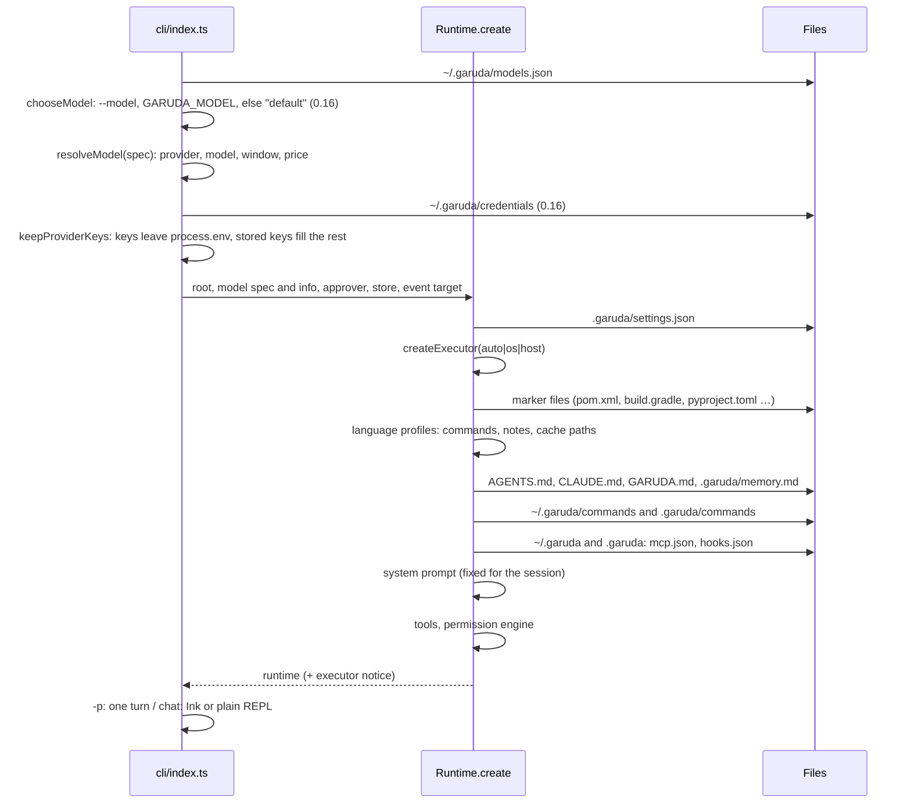
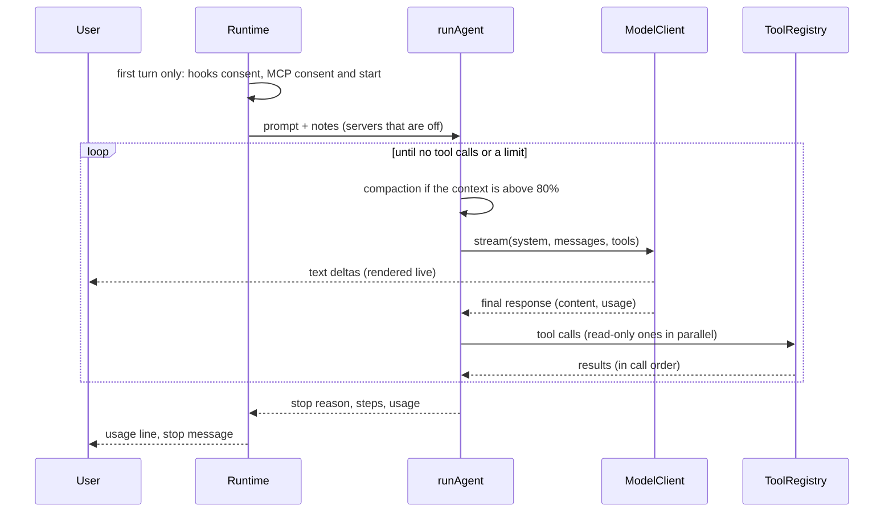
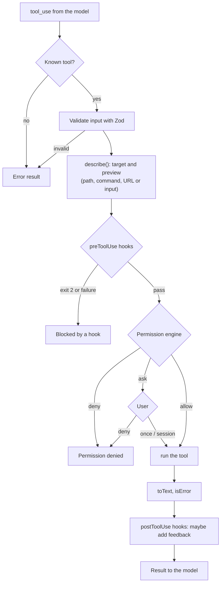
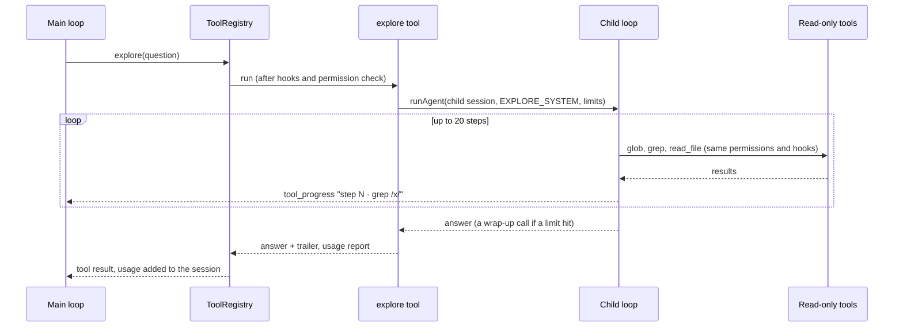
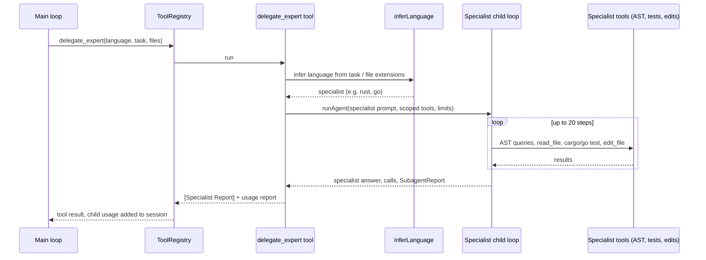
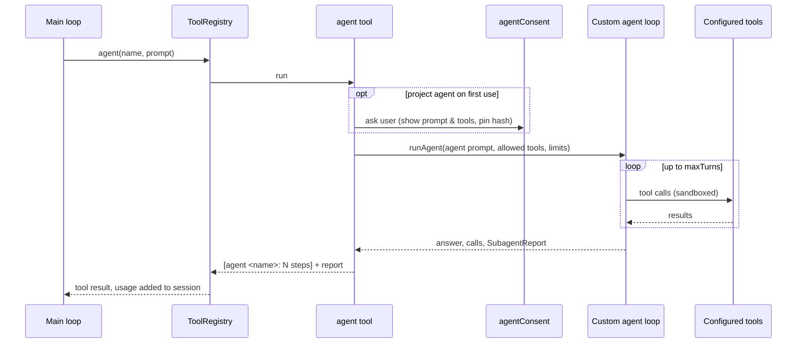
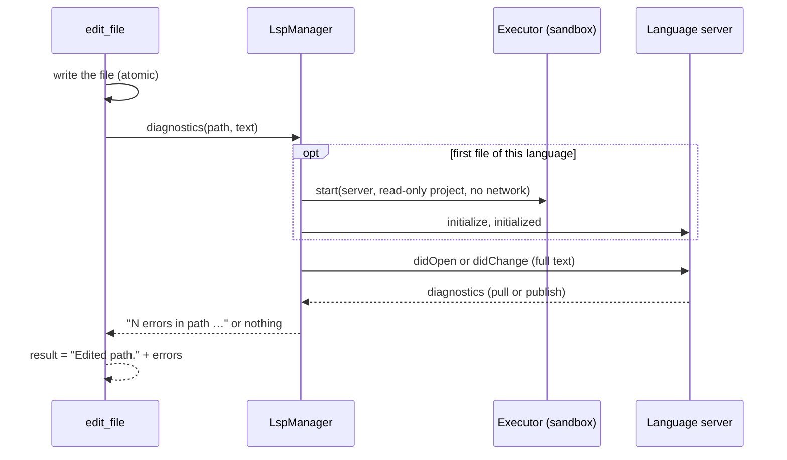
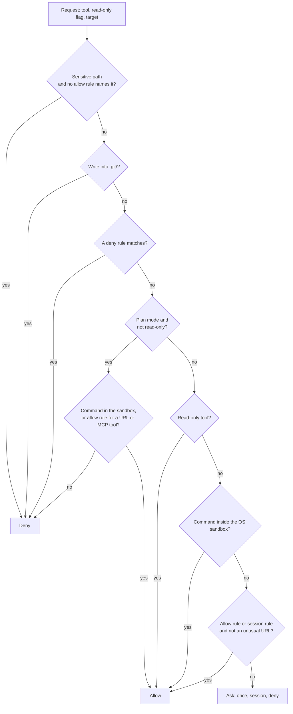
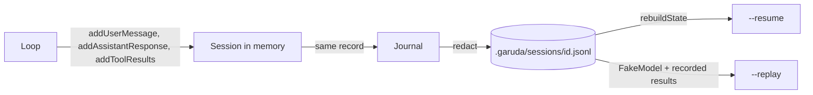
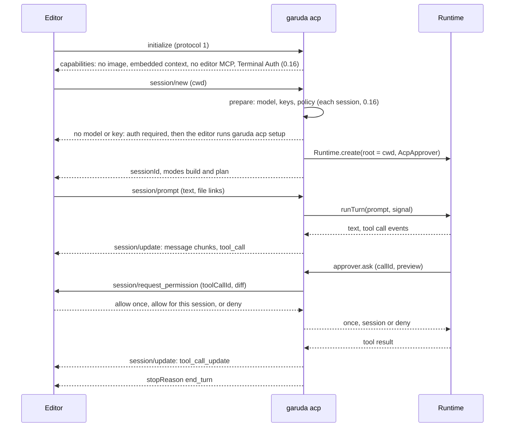

# High-level design

Version 0.16.0 (`garuda setup` and the editor sign-in; editors over ACP since 0.15.0; on top of 0.14.1: the 0.14–0.17 branches after the merge gate and Garuda's own review of nine areas). This document shows how the parts work together. The component documents in
[lld/](lld/) give the details.

## 1. Modes of use

| Command | Mode | Output |
| --- | --- | --- |
| `garuda` | Chat. Ink view on a terminal, plain lines otherwise. | Interactive. |
| `garuda -m ollama/qwen3-coder:30b` | Any mode with another provider (`<provider>/<model>`). | Same. |
| `garuda -p "task"`, `echo task \| garuda` | One task, then exit. | Model text on stdout, activity on stderr. Exit code 0 (done), 1 (error), 2 (a limit stopped the run) or 130 (Ctrl-C). |
| `garuda --resume [id]` | Continue the latest or a given session. | Chat or one task. |
| `garuda --replay <id\|file>` | Play a session back with recorded results. No API calls. | "matches" or a list of differences. |
| `garuda eval` | Run eval tasks in scratch folders; `--parallel n`, `--batch on` (0.7) for the Batch API. | A table and `report.json`. |
| `garuda run <job> [--at HH:MM] [-m model]` | Run a scheduled job (0.7): its plan, unattended, in its own worktree and branch. | The run's lines, then the job report (also in `.garuda/jobs/<id>.md`). |
| `garuda night [--at HH:MM] [--parallel n]` | Run the project's night queue (0.11), up to 3 jobs at a time. | One line per job; the digest (also in `.garuda/jobs/night-<date>.md`). |
| `garuda acp` (0.15) | Garuda as an agent for an editor over the Agent Client Protocol (VS Code with an extension, Zed, JetBrains, Neovim, Emacs). The editor starts it. | JSON-RPC on stdout for the editor; logs and notices on stderr. |
| `garuda setup` (0.16) | Choose a provider and model, enter the key once; `--show`, `--forget`. The editor runs it as ACP Terminal Auth (`garuda acp setup`). See [setup.md](lld/setup.md). | Questions on a terminal; a masked summary. Exit code 0 when done. |
| `garuda eval -s java` / `--prepare java` | Check the toolchain, then run the Java (or Python) suite; `--prepare` fills `~/.m2` once. | A hint when a toolchain is missing; otherwise the same report. |
| `garuda eval --from-git` / `-s repo` (0.12) | Turn recent commits (code + tests, tests fail at the parent and pass at the commit) into tasks in `.garuda/evals/repo-suite.json`; run them in git worktrees at the parent. | The kept count and skip reasons; then the same report. |

## 2. Start of a process

The executor choice decides much of the behaviour: with an OS sandbox, commands run with no approval;
without one, every command asks. MCP servers and hooks start later, before the first turn, because
their consent questions need the chat UI.

## 3. One turn

A stream that breaks in the middle (a closed connection, an overload) is sent again up to 2 times, with a
notice; the session keeps only the complete response.

Before the loop (0.6), the runtime attaches the files of `@path` mentions to the prompt (they count as
read), adds the pending notes (for example the output of a `!command`), and decides whether Claude's web
search goes into the requests (it asks once per session). A server search runs inside the model reply;
a reply that stops with `pause_turn` goes straight into the next step.

A response cut off at the output limit (0.12) does not end the turn: the loop keeps its text, asks the
model to go on (a `continue` record), and raises `max_tokens` to 32,000, up to 3 times per run.

Stop reasons: `done`, `max_steps` (default 50), `token_budget` (default 20 M), `repeated_calls` (3
identical calls in a row), `max_tokens` (after the recoveries), `refusal`. Ctrl-C aborts the turn and kills its commands; a
second Ctrl-C exits Garuda.

## 4. One tool call

Every tool call, built-in or MCP, goes through the same pipeline in `ToolRegistry.execute`. The
pipeline never throws: every failure becomes an error result that the model can read.

### The explore subagent (0.3)

`explore` is a read-only tool, so it passes the same pipeline with no approval. Its `run` starts a
second agent loop with its own session and read-only tools. Details: [lld/agents.md](lld/agents.md).

### Mixture-of-Experts language specialist subagents (0.17)

When `moe.enabled` is on (or `subagents.enabled: true`), the orchestrator can call `delegate_expert`.
The task is routed via `inferLanguage` to a language specialist (Go, Rust, Python, Java, TypeScript),
which spawns an isolated child subagent with language-specific AST tools, test runners (`cargo test`, `go test ./...`,
`pytest`, `mvn test`, `pnpm test`), and idiomatic prompt rules. Details: [lld/agents.md](lld/agents.md).

### Custom subagents (0.5)

Markdown files in `~/.garuda/agents/` or `.garuda/agents/` define custom subagents in Claude Code format.
The `agent` tool runs the custom agent in an isolated child session with its allowed tool subset.

### Formatting and diagnostics after an edit (0.4, 0.10)

With formatters on (0.10, opt-in), `edit_file` and `write_file` run the project's formatter in the OS
sandbox first; the result shows its diff, and the file counts as read in its new form. Details:
[lld/format.md](lld/format.md).

With LSP on, `edit_file` and `write_file` write the file, then ask the `LspManager` for the errors of that
file. The manager starts the language server on first use, in the OS sandbox. Details:
[lld/lsp.md](lld/lsp.md).

## 5. Permission decision

Plan mode (0.4) never asks: file writes, edits and `remember` are always denied, and a command runs
only in the OS sandbox, which then cannot write the project (temp folders and package caches only).

Rules use one syntax everywhere: `tool` or `tool(pattern)`. Patterns are globs for paths, wildcards
for commands (each part of `a && b | c` is checked), hosts for URLs, and a trailing `*` in the tool
name for MCP servers (`mcp__github__*`).

## 6. Where commands run

| Runs | Through | Sandbox | Approval |
| --- | --- | --- | --- |
| `bash` tool | `Executor.run` | Yes (writes only in root, temp, caches; no network; secrets unreadable) | None in the sandbox; always for `outside_sandbox: true` |
| Hooks | `Executor.run` | Yes; network only if the hook says so | Project hooks: consent once |
| MCP servers | `Executor.start` | Yes; network only if the server config says so | Project servers: consent once; every tool call asks unless a rule |
| Eval checks | `HostExecutor` | No (Garuda's own test commands) | None |

The executor is Seatbelt on macOS, bubblewrap on Linux, or the host when neither works (`auto`).

Network allowlist (0.13). With `network.allow` in the settings, the runtime starts a local proxy
before the first turn (after the user agreed to the project's list). Sandboxed commands get
HTTP(S)_PROXY to it and can reach nothing else; the proxy lets listed hosts through, asks for other
hosts (jobs and evals deny), and the bash result names each blocked host. See
[lld/sandbox.md](lld/sandbox.md).

## 7. Sessions

Every change to the conversation goes through `session.ts`, which writes the same change to the
journal. So the file always matches memory.

### Undo (0.4)

Before each turn, the runtime takes a snapshot of the files in a git store of Garuda's own
(`~/.garuda/snapshots`) and writes a `snapshot` record. `/undo` asks, restores the files to the last
snapshot and cuts the turn out of the messages (`undo` record); `/redo` does the reverse. Details:
[lld/undo.md](lld/undo.md).

`/diff` (0.6) compares the first snapshot of the session (or the last turn's, `/diff last`) with the files
now.

### Sessions, models and export in the chat (0.6)

`/sessions` lists the project's sessions from `SessionStore.list()`; `/sessions <n|id>` resumes one in the
same process; `/sessions rename` and `delete` (0.8) give one a title or delete it after a question. `/models` lists the known and configured models; `/models <ref>` switches the main model for
the next turns (`modelId`, window, price and client change together; a `model` record keeps it).
`/export` writes the session records as Markdown. `/compact [focus]` (0.8) summarises the older turns at
once, with the automatic compaction's summary step. Details: [lld/cli.md](lld/cli.md),
[lld/runtime-and-loop.md](lld/runtime-and-loop.md).

### Scheduled jobs (0.7)

`/schedule` turns the last finished plan into a job file with its own approval list (from the plan's
`permissions` block), after one question. `garuda run <id>` builds it later in a git worktree on the
branch `garuda/job-<id>`: the permission engine allows the list and denies (never asks) everything else,
then Garuda commits the changes on the branch and writes a report. Proof of work (0.11): the tests run
before and after in the sandbox, risk flags come from the change, and the same model as a principal
engineer reviews the diff; the report starts with "Ready to merge" or "Needs a look". The night shift
(0.11): `/schedule` puts each job in the project's queue; `garuda night` runs it, up to 3 jobs at a time,
and writes one digest. On macOS, `/schedule HH:MM` can add a launchd agent that starts the queue (or one
job) with nobody at the terminal and removes itself after it. With a Claude
model, a job can use the Batch API at half price: a step that waits more than its limit (20 minutes) runs on
the normal API, and from 15 minutes before the finish-by time (07:00) the whole job does. Details:
[lld/jobs.md](lld/jobs.md).

### Custom agents (0.5)

When agent files exist, the runtime registers the `agent` tool. A call runs a child session (shared with
explore, `agents/child.ts`) with the agent's instructions and tools, through the same permission engine,
hooks and executor, and returns a short report. A project agent asks at its first use. Details:
[lld/agents.md](lld/agents.md).

### Skills (0.5)

At start, the runtime reads skill folders (`~/.garuda/skills`, `~/.claude/skills`, `.garuda/skills`,
`.claude/skills`). When at least one exists, it registers the `skill` tool, whose description lists each
skill's name and description, and adds two lines to the system prompt. The model loads a skill with the tool;
the user runs one with `/name`. A project skill asks at its first load. Details: [lld/skills.md](lld/skills.md).

### JSON output (0.5)

With `-p --output-format json` the CLI prints one `result` line at the end; with `stream-json` it prints
`system/init`, then an `assistant` line per model response and a `user` line per tool result, then the
`result`. The field names are Claude Code's. A `JsonOutput` renderer takes the agent events, so the loop
does not change; stdout holds only JSON. Details: [lld/cli.md](lld/cli.md).

### Web search (0.5)

`web_search` is a normal tool. It calls the user's backend (Brave, Tavily or SearXNG, configured only in
the home folder), after a question that shows the query. Results come back as untrusted text; the model
reads pages with `web_fetch`. Claude's own search (0.6) is a server tool: the Anthropic adapter sends it,
the API runs it inside the reply, and its blocks go back unchanged; the chat asks once per session, and
the other backend is the fallback. Details: [lld/web.md](lld/web.md).

### Init (0.5)

`garuda init` starts the chat with `/init` as the first line. `/init` reads other agents' files (no
model), shows a preview and writes new files only after one yes; it offers `git init`; then it runs an
init turn whose prompt depends on the folder: read the code and write `AGENTS.md`, or ask what to build.
Details: [lld/init.md](lld/init.md).

### Background daemons (0.14, off by default)

With `daemons.enabled: true`, `bash(is_daemon: true)` starts a long-running command through the
executor and returns `{ daemonId, pid, command, status }` at once. The companion `process_manager`
tool provides `list`, `status`, `logs` (line count and stdout/stderr filter) and `kill`.
`DaemonManager` in `src/sandbox/daemon.ts` keeps a capped in-memory log per daemon, and
`Runtime.close()` stops all running daemons. Without the setting, neither the parameter nor the tool
is offered to the model.

### Interactive patch staging (0.14)

When file modifications are presented for approval in the Ink chat, pressing `h` enters interactive
hunk-by-hunk review. The user steps through individual hunks with colored diffs: `y` to stage, `n` to
skip, `a` to stage all, `d` to discard all, and arrows to navigate. At the end: all hunks staged =
the whole edit; none = denied; some = the engine passes the accepted hunk numbers to `edit_file`
(`PermissionDecision.hunks`, `ToolContext.approvedHunks`), which writes only those hunks
(`applyHunks`) and tells the model which hunks were rejected. It writes nothing if the change is no
longer the one reviewed. Review is offered only for `edit_file` and only when the preview shows every
hunk (a cut preview has no `h`). Tests check the file on disk (`test/hunkApproval.test.ts`).

## 8. Context management

- The system prompt is fixed for a session (N2). It holds the rules, the sandbox note, the MCP, web, web
  search, hooks, skills and agents notes when those features are on, the instruction files (`AGENTS.md`, `CLAUDE.md`, `GARUDA.md`) and
  `.garuda/memory.md`.
- At 80% of the context window, compaction runs: first it trims long tool outputs in older turns; if the
  context is still above 60%, the model summarises the older turns. The last 4 steps stay in full.
- `read_file` does not send the same lines of an unchanged file twice.

## 9. Extensions

| Extension | Configured in | Adds |
| --- | --- | --- |
| MCP servers (stdio) | `~/.garuda/mcp.json`, `.garuda/mcp.json` | Tools named `mcp__<server>__<tool>`. |
| Hooks | `~/.garuda/hooks.json`, `.garuda/hooks.json` | Checks before calls, feedback after calls. |
| Web fetch | `.garuda/settings.json` (`web`) | The `web_fetch` tool. |
| Web search (0.5) | `~/.garuda/search.json` or `BRAVE_API_KEY` / `TAVILY_API_KEY` (user only) | The `web_search` tool; with a `claude` section, Claude's search (0.6). |
| Skills (0.5) | `~/.garuda/skills`, `~/.claude/skills`, `.garuda/skills`, `.claude/skills` | The `skill` tool and `/name`. |
| Custom agents (0.5) | `~/.garuda/agents`, `~/.claude/agents`, `.garuda/agents`, `.claude/agents` | The `agent` tool and `/agents`. |
| Custom slash commands (0.4) | `~/.garuda/commands`, `.garuda/commands` | `/name` prompts. |
| Code index | `.garuda/settings.json` (`codeIndex`) | `find_symbol`, `find_references`, `find_callers`, `impact_analysis`, `ast_query`, `repo_map`. |
| LSP diagnostics | `.garuda/settings.json` (`lsp`), `--lsp`, `~/.garuda/lsp.json` | Language server errors in edit results. |
| Formatters (0.10) | `.garuda/settings.json` (`formatters`) | The project's formatter after each edit; off by default. |
| Language experts & plugins (0.16) | `~/.garuda/languages/` (`.garuda/languages/` is not loaded, merge gate) | Code index AST support for languages (TS/JS, Python, Java, Go, Rust, and user plugins). |
| MoE language specialists (0.17) | `.garuda/settings.json` (`moe`), built-in | Subagent delegation tool `delegate_expert` and `/experts`. |
| Team policy & audit log (0.17, W5) | The managed policy file and `~/.garuda/policy.json` (never the project's), `~/.garuda/audit/<project>-<hash>/*.jsonl` | Team guardrails that a project cannot loosen; an audit log with redaction and a hash chain per file (tamper-evident, not tamper-proof), with `/audit` and `/audit verify`. |
| Executors | `src/sandbox/` (`Executor`) | Another isolation technology. |
| Session stores | `src/session/` (`SessionStore`) | Another place for sessions. |

## 10. Chat interface

The Ink chat keeps all state in `ChatStore`. The store is also the renderer, the approver and the
Ctrl-C target of a turn, so the logic is testable without a terminal. Finished lines print once into
the terminal scrollback; the live area holds only the open text block, running tools, the approval
choice, the queue, the input line and a footer. See [cli.md](lld/cli.md).

Input (0.6): Esc stops a task; `\` + Enter or Alt+Enter make a new line; Ctrl-P (0.9) opens the command
palette; Ctrl-G or `/editor` opens
`$EDITOR`; `@path` attaches a file; `!command` runs a command as the bash tool would; Tab completes commands
and paths (0.8: a fuzzy file search when no path starts so), and since 0.8 command arguments (models,
sessions, jobs, fixed words). A `Notifier` sends a desktop notification (OSC 9) or the bell when an approval waits or a long
task ends, and stays quiet while the window has focus (terminal focus reporting).

Custom slash commands (0.4) are Markdown prompts in `~/.garuda/commands` and `.garuda/commands`. A project
command shows its text and asks the first time, like project hooks. See [commands.md](lld/commands.md).

### Editors over ACP (0.15)

`garuda acp` is a second front end on the same runtime. The editor starts it, and each editor
session gets its own runtime: the permission engine, the sandbox, the policy and the audit log are
those of the terminal. See [acp.md](lld/acp.md).

`session/cancel` aborts the turn's signal: the command stops, a waiting question answers deny, and
the prompt ends with `cancelled`. Garuda reads and writes files and runs commands itself; it does
not use the editor's file and terminal methods.

## 11. Quality

- About 620 unit and acceptance tests, all with the fake model.
- Contract tests run every executor (host, Seatbelt, bubblewrap) through the same suite.
- Architecture tests enforce the dependency rules.
- Evals: a basic suite (10 tasks), a hard suite (6 tasks on a generated repo of about 107 files), and
  Java and Python suites (5 tasks each, Maven with JUnit 5 and pytest). The repo suite (0.12) is built
  from the user's own commits (`garuda eval --from-git`, then `-s repo`).
  0.1 baseline on claude-sonnet-5: basic 10/10; hard 6/6 at about 50 steps and $0.19 in total.
