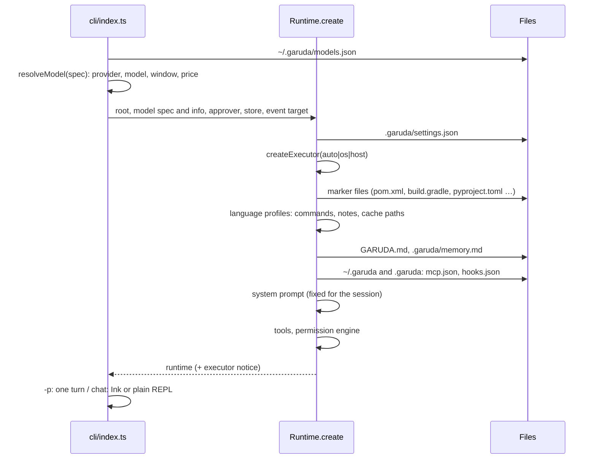
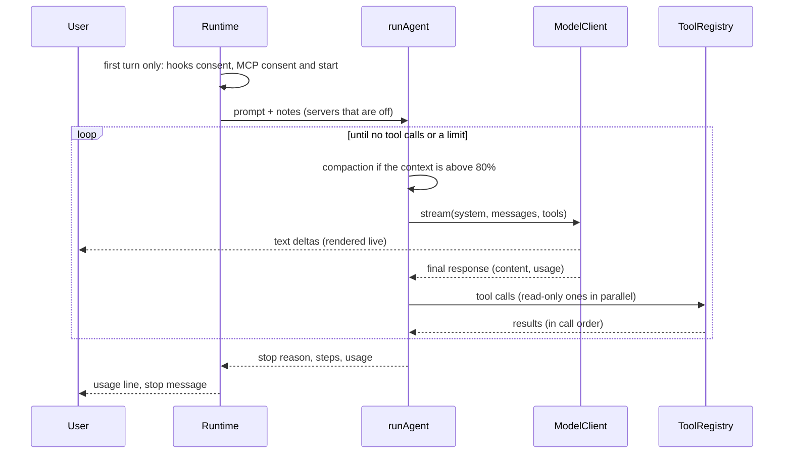
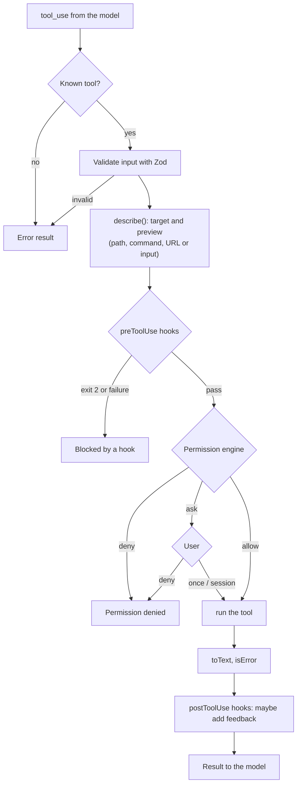
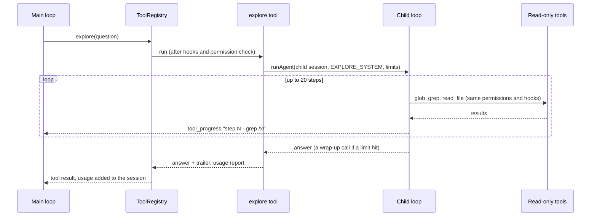
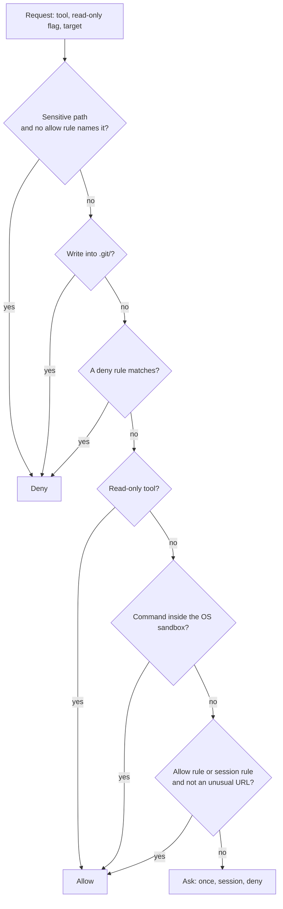
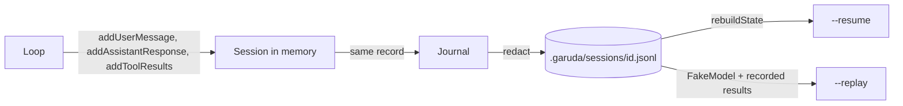

# High-level design

Version 0.3.0 (in progress). This document shows how the parts work together. The component documents in
[lld/](lld/) give the details.

## 1. Modes of use

| Command | Mode | Output |
| --- | --- | --- |
| `garuda` | Chat. Ink view on a terminal, plain lines otherwise. | Interactive. |
| `garuda -m ollama/qwen3-coder:30b` | Any mode with another provider (`<provider>/<model>`). | Same. |
| `garuda -p "task"`, `echo task \| garuda` | One task, then exit. | Model text on stdout, activity on stderr. Exit code 0 (done), 1 (error), 2 (a limit stopped the run) or 130 (Ctrl-C). |
| `garuda --resume [id]` | Continue the latest or a given session. | Chat or one task. |
| `garuda --replay <id\|file>` | Play a session back with recorded results. No API calls. | "matches" or a list of differences. |
| `garuda eval` | Run eval tasks in scratch folders. | A table and `report.json`. |
| `garuda eval -s java` / `--prepare java` | Check the toolchain, then run the Java (or Python) suite; `--prepare` fills `~/.m2` once. | A hint when a toolchain is missing; otherwise the same report. |

## 2. Start of a process

The executor choice decides much of the behaviour: with an OS sandbox, commands run with no approval;
without one, every command asks. MCP servers and hooks start later, before the first turn, because
their consent questions need the chat UI.

## 3. One turn

A stream that breaks in the middle (a closed connection, an overload) is sent again up to 2 times, with a
notice; the session keeps only the complete response.

Stop reasons: `done`, `max_steps` (default 50), `token_budget` (default 20 M), `repeated_calls` (3
identical calls in a row), `max_tokens`, `refusal`. Ctrl-C aborts the turn and kills its commands; a
second Ctrl-C exits Garuda.

## 4. One tool call

Every tool call, built-in or MCP, goes through the same pipeline in `ToolRegistry.execute`. The
pipeline never throws: every failure becomes an error result that the model can read.

### The explore subagent (0.3)

`explore` is a read-only tool, so it passes the same pipeline with no approval. Its `run` starts a
second agent loop with its own session and read-only tools. Details: [lld/agents.md](lld/agents.md).

## 5. Permission decision

Rules use one syntax everywhere: `tool` or `tool(pattern)`. Patterns are globs for paths, wildcards
for commands (each part of `a && b | c` is checked), hosts for URLs, and a trailing `*` in the tool
name for MCP servers (`mcp__github__*`).

## 6. Where commands run

| Runs | Through | Sandbox | Approval |
| --- | --- | --- | --- |
| `bash` tool | `Executor.run` | Yes (writes only in root, temp, caches; no network; secrets unreadable) | None in the sandbox; always for `outside_sandbox: true` |
| Hooks | `Executor.run` | Yes; network only if the hook says so | Project hooks: consent once |
| MCP servers | `Executor.start` | Yes; network only if the server config says so | Project servers: consent once; every tool call asks unless a rule |
| Eval checks | `HostExecutor` | No (Garuda's own test commands) | None |

The executor is Seatbelt on macOS, bubblewrap on Linux, or the host when neither works (`auto`).

## 7. Sessions

Every change to the conversation goes through `session.ts`, which writes the same change to the
journal. So the file always matches memory.

## 8. Context management

- The system prompt is fixed for a session (N2). It holds the rules, the sandbox note, the MCP, web and
  hooks notes when those features are on, `GARUDA.md` and `.garuda/memory.md`.
- At 80% of the context window, compaction runs: first it trims long tool outputs in older turns; if the
  context is still above 60%, the model summarises the older turns. The last 4 steps stay in full.
- `read_file` does not send the same lines of an unchanged file twice.

## 9. Extensions

| Extension | Configured in | Adds |
| --- | --- | --- |
| MCP servers (stdio) | `~/.garuda/mcp.json`, `.garuda/mcp.json` | Tools named `mcp__<server>__<tool>`. |
| Hooks | `~/.garuda/hooks.json`, `.garuda/hooks.json` | Checks before calls, feedback after calls. |
| Web fetch | `.garuda/settings.json` (`web`) | The `web_fetch` tool. |
| Code index | `.garuda/settings.json` (`codeIndex`) | `find_symbol`, `find_references`, `repo_map`. |
| Language experts | `src/knowledge/` (`LanguageExpert`) | Code index support for a language. |
| Executors | `src/sandbox/` (`Executor`) | Another isolation technology. |
| Session stores | `src/session/` (`SessionStore`) | Another place for sessions. |

## 10. Chat interface

The Ink chat keeps all state in `ChatStore`. The store is also the renderer, the approver and the
Ctrl-C target of a turn, so the logic is testable without a terminal. Finished lines print once into
the terminal scrollback; the live area holds only the open text block, running tools, the approval
choice, the queue, the input line and a footer. See [cli.md](lld/cli.md).

## 11. Quality

- 245 unit and acceptance tests, all with the fake model.
- Contract tests run every executor (host, Seatbelt, bubblewrap) through the same suite.
- Architecture tests enforce the dependency rules.
- Evals: a basic suite (10 tasks), a hard suite (6 tasks on a generated repo of about 107 files), and
  Java and Python suites (5 tasks each, Maven with JUnit 5 and pytest).
  0.1 baseline on claude-sonnet-5: basic 10/10; hard 6/6 at about 50 steps and $0.19 in total.
