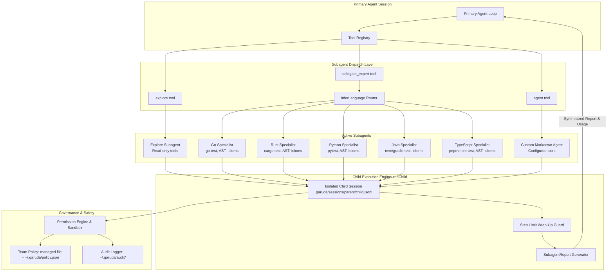
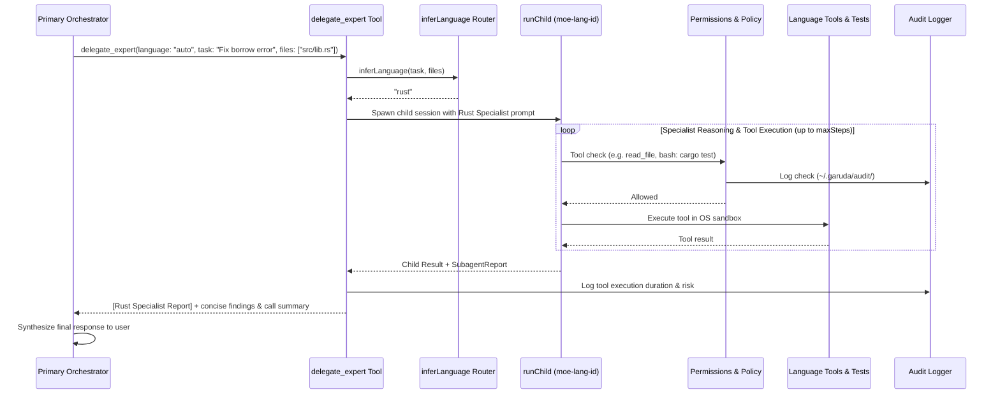
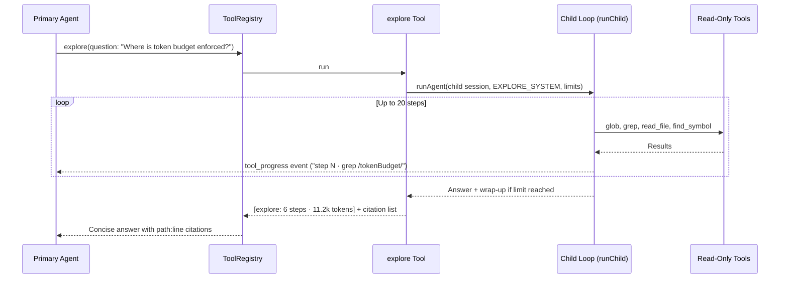
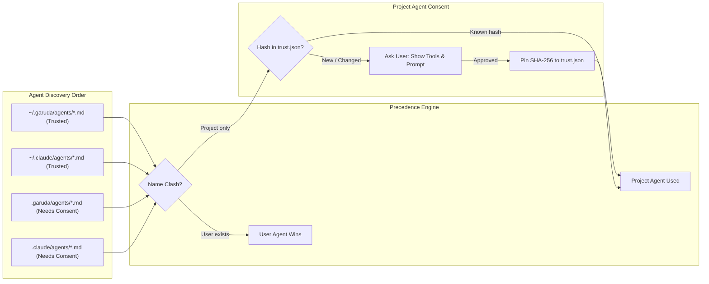
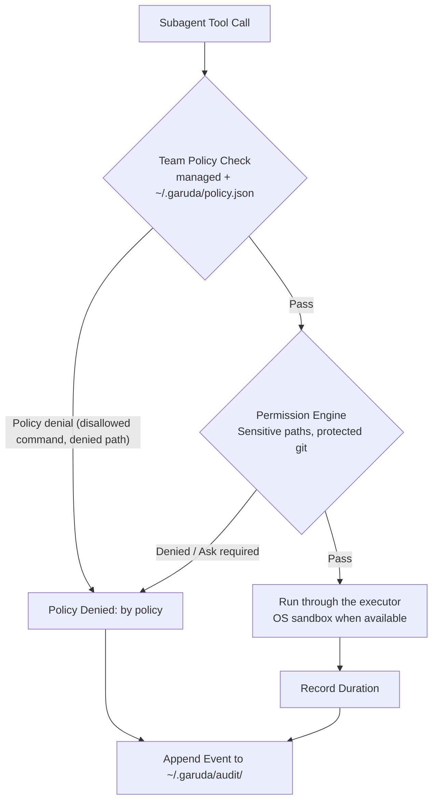

# Subagents (`src/agents/`)

## 1. Overview & Architecture

Subagents in Garuda keep the primary orchestrator agent's context window lean, focused, and token-efficient. Instead of loading instruction sets, file dumps, and broad search outputs into the main conversation, the orchestrator delegates sub-tasks to child agent sessions that execute in isolation and return concise, actionable reports.

Garuda implements a three-tier subagent architecture:

1. **Explore Subagent (`explore.ts`, 0.3)**: A read-only reconnaissance agent that executes broad search queries across the repository using `glob`, `grep`, `read_file`, and code index tools.
2. **Mixture-of-Experts (MoE) Language Specialists (`moe.ts`, 0.17)**: Autonomous specialist subagents for **Go**, **Rust**, **Python**, **Java**, and **TypeScript** equipped with language-specific AST tools, test runners (`cargo test`, `go test ./...`, etc.), and idiomatic prompt guidelines.
3. **Custom Agents (`custom.ts`, `agentTool.ts`, 0.5)**: User and project Markdown agents configured in Claude Code subagent format (`.garuda/agents/*.md`, `.claude/agents/*.md`).

All subagent types share a common child execution engine (`child.ts`) that enforces security boundaries, session journaling, token budgets, and step limits.



### Module Breakdown

| File | Purpose |
| --- | --- |
| `child.ts` | Shared child session runner (`runChild`): isolated session initialization, step and token budgeting, wrap-up call when the budget has room (G06), `SubagentReport` generation, and call logging. |
| `moe.ts` | Mixture-of-Experts language specialist architecture: `SPECIALIST_SPECS` for 5 languages, `inferLanguage` routing, `buildSpecialistSystem`, and `createMoeDispatchTool` (`delegate_expert`). |
| `explore.ts` | The `explore` subagent tool (0.3): read-only code exploration that answers open questions without polluting the main context with file contents. |
| `custom.ts` | Custom agent loader: discovers and parses Markdown agent definitions from 4 folders, tool mapping, and hash-pinned consent (`agentConsent`). |
| `agentTool.ts` | The `agent` tool (0.5): validates agent invocations, passes custom toolsets, enforces single-agent write execution (`runsAlone`), and synthesizes reports. |

---

## 2. Mixture-of-Experts (MoE) Language Specialists (`moe.ts`, 0.17)

### Motivation & Concept
In polyglot codebases, loading rules, test patterns, and syntax constraints for all languages into the primary system prompt wastes tokens and increases instruction-following drift. The MoE subagent system delegates language-specific tasks to dedicated specialist child agents that operate with tailored instructions, scoped tools, and test harnesses.



### Specialist Profiles (`SPECIALIST_SPECS`)

Garuda registers 5 built-in language specialist profiles:

| Language (`id`) | Specialist Name | File Extensions | Default Test Runner | Key Idiomatic Guidelines |
| --- | --- | --- | --- | --- |
| `go` | Go Specialist | `.go` | `go test ./...` | Structs & interfaces, explicit error handling (`errors.Is`/`As`), goroutines/channels/sync, exported visibility, table-driven tests. |
| `rust` | Rust Specialist | `.rs` | `cargo test` | Ownership, borrowing, lifetimes, `Result<T, E>` / `Option<T>` with `?`, traits, Cargo workspace layouts, unit (`#[test]`) & integration tests. |
| `python` | Python Specialist | `.py` | `pytest` | Type annotations (PEP 484/585/604), dataclasses & Pydantic, generators, async/await, context managers, pytest fixtures. |
| `java` | Java Specialist | `.java` | `./mvnw test \|\| gradle test` | Records, sealed interfaces, pattern matching, Streams, Optionals, Maven/Gradle lifecycles, JUnit 5 & Mockito. |
| `typescript` | TypeScript/JS Specialist | `.ts`, `.tsx`, `.js`, `.jsx`, `.mts`, `.cts` | `pnpm test \|\| npm test` | Strict null checking, discriminated unions, generics, modern ESM, Node.js/browser APIs, Vitest/Jest conventions. |

### Automatic Language Inference (`inferLanguage`)
When `language: "auto"` is passed, `inferLanguage(task, files)` inspects the relevant file extensions first (`.go` → `go`, `.rs` → `rust`, etc.). If no files are given, keyword pattern matching inspects the task string (e.g. `cargo`, `lifetime`, `goroutine`, `pytest`, `pom.xml`, `vitest`). If ambiguous, it defaults to `typescript`.

### Scoped Toolset (`ALLOWED_TOOLS`)
Specialists receive only tools relevant to code inspection, AST queries, edits, and builds:
- Read tools: `read_file`, `glob`, `grep`.
- AST & Index tools: `find_symbol`, `find_references`, `find_callers`, `impact_analysis`, `ast_query`, `repo_map`.
- Write & build tools: `edit_file`, `write_file`, `bash`.
- **Excluded**: Recursive subagents (`delegate_expert`, `explore`, `agent`) are strictly prohibited to prevent nesting loops.

### Configuration
Turned on via project settings (`.garuda/settings.json`):
```json
{
  "moe": {
    "enabled": true,
    "maxSteps": 20,
    "tokenBudget": 150000
  }
}
```
Off by default; only `moe.enabled: true` turns it on (`subagents` alone does not, merge gate). `delegate_expert`
has `runsAlone: true`: two specialist calls never run at the same time, because a specialist can
write files (G05).

---

## 3. The `explore` Subagent (`explore.ts`, 0.3)

`createExploreTool(options)` creates a read-only child agent for broad code reconnaissance.



### Key Properties
- **Read-Only**: Executes strictly without user prompts; parallel explore calls in a single turn run concurrently.
- **Tools**: `readOnlyTools(codeIndex)`: `glob`, `grep`, `read_file`, `find_symbol`, `find_references`, `repo_map`.
- **System Prompt (`EXPLORE_SYSTEM`)**: Instructs the child to search broadly first, read only essential lines, cite files as `path:line`, and keep responses under 300 words.
- **Safety**: Child reads do **not** satisfy `read_file` prerequisites for `edit_file` in the parent agent: the main agent must read a file directly before modifying it.

---

## 4. Custom Subagents (`custom.ts`, `agentTool.ts`, 0.5)

Users can define custom subagents using Markdown files compatible with Claude Code's format:



### Folder Discovery & Trust Hierarchy

| Folder | Source | Trust Level |
| --- | --- | --- |
| `~/.garuda/agents/*.md` | User | Trusted (runs immediately) |
| `~/.claude/agents/*.md` | User (Claude Code) | Trusted (runs immediately) |
| `<root>/.garuda/agents/*.md` | Project | Asks consent on first use; pinned by SHA-256 |
| `<root>/.claude/agents/*.md` | Project (Claude Code) | Asks consent on first use; pinned by SHA-256 |

*Security Rule: User agents always take precedence over project agents. A repository cannot shadow or replace an agent the user trusts.*

### Custom Agent Frontmatter Spec
```markdown
---
name: security-auditor
description: Audits code for SQL injection, CSRF, and secret leaks
tools: Read, Grep, Glob
maxTurns: 15
---
You are an expert application security auditor...
```

- `maxTurns`: lowers the step limit for this agent; it never raises the limit of the settings
  (`subagents.maxSteps`, capped by the team policy) (0.14, review). The consent question shows it.
- `tools`: Claude Code names map directly to Garuda tools (`Read` → `read_file`, `Edit` → `edit_file`, etc.). Omitted tools default to read-only.
- `runsAlone`: If any custom agent has write permissions, `agent` tool runs exclusively without concurrent tool execution.

---

## 5. Child Execution Engine (`child.ts`)

`runChild(run: ChildRun, context: ToolContext)` powers all subagent types:

1. **Session Isolation**: Spawns a dedicated child session ID (e.g. `moe-rust-1`, `explore-2`, `agent-reviewer-1`) stored at `.garuda/sessions/<parent-id>/<child-id>.jsonl`.
2. **Limit Guardrails**:
   - `maxSteps`: Model turns limit (default 20, max 200).
   - `tokenBudget`: Input, output, and cache tokens cap (default 150,000).
   - The team policy's `limits` cap both, for explore, custom agents and MoE (`withPolicyLimits`, 0.14,
     review). Limit: each child has its own budget; it does not take what the parent has left.
3. **Wrap-Up Recovery**: When a child hits its step limit, its token limit or repeats a call, `runChild` adds a wrap-up prompt (`WRAP_UP`) and makes one more model call (tool calls in it are ignored), so the subagent can say what it found and what is still open. The call runs only when it fits in the budget that is left (G06): the tokens used so far, plus the context of the last response, plus the output limit, must not pass `tokenBudget`. With no room there is no call; the answer is the child's last text, or a note that says the budget ran out.
4. **Usage Accounting**: Emits a `SubagentReport` attached to the tool's `ToolOutcome`. The primary orchestrator adds child token usage and cost to the parent session totals. The report's usage is the child session's whole usage: its responses, its compaction summaries and the wrap-up call (0.14.1, review). A run that fails after it used the model throws `SubagentFailure`, which carries the report; the registry adds it to the error outcome, so the tokens still count (on Ctrl-C they are not counted).
5. **One end record**: `runAgent` runs with `endRecord: false`, and `runChild` writes the single `end` record of the child journal: the loop's stop reason, `wrap_up`, `no_wrap_up`, `error` or `interrupted`, with the final step count (0.14.1, review: there were two).
6. **What the parent has**: a child's edits get the parent's diagnostics and formatters (`context.diagnostics`, `context.format`), and MoE specialists get Claude's web search when the runtime offers it (0.14.1, review). A model client that fails to start is not kept, so the next call tries again.

---

## 6. Observability & User Interface

### Start Banner Integration
The CLI startup banner provides dedicated, aligned rows for active capabilities:

```text
╭────────────────────────────────────────────────────────────────────────────────────────────────────╮
│ ✦ Garuda 0.16.0 · a terminal coding agent                                                          │
│                                                                                                    │
│   model      claude-sonnet-5                                                                       │
│   sandbox    seatbelt · no network                                                                 │
│   folder     ~/dev/garuda                                                                          │
│   subagents  explore · 5 MoE experts (Go, Rust, Python, Java, TS)                                  │
│   agents     1 agent (bug-finder)                                                                  │
│   skills     1 skill (commit)                                                                      │
│   tools      TypeScript · 1 MCP server · web_fetch · web_search: Claude + fallback                 │
╰────────────────────────────────────────────────────────────────────────────────────────────────────╯
```

### Slash Commands
- **`/experts`**: Lists all 5 MoE language specialists, their test commands, supported extensions, and indexed file counts.
- **`/agents`**: Lists configured custom subagents, their sources (`user` / `project`), allowed tools, and model targets.
- **`/session`**: Displays the active session ID, log path, and a consolidated capability inventory (subagents, agents, skills, tools) with cross-reference tips.
- **`/audit`**: Displays the policy files and recent audit events (risk levels, durations); `/audit verify` checks the hash chains.

---

## 7. Security, Team Policy & Audit Containment

A subagent's tool calls pass the same checks as the main agent's:



- **Team policy (the managed file and `~/.garuda/policy.json`)**: checked before any subagent tool runs. A denied command or path is refused with `by: policy`. `grep`, `glob` and the code index skip files that `denyPaths` denies (G04).
- **Audit Trail (`~/.garuda/audit/`)**: Every subagent authorization check is recorded with timestamp, session ID, tool name and risk level (`low`, `medium`, `high`, `critical`). The outcome of a tool run inside a subagent is not recorded yet (G07, open).
- **Snapshot & Worktree Isolation**: Child runs never contaminate undo snapshot diffs (`SNAPSHOT_EXCLUDES`) or scheduled job git branches (`NEVER_COMMIT`).
