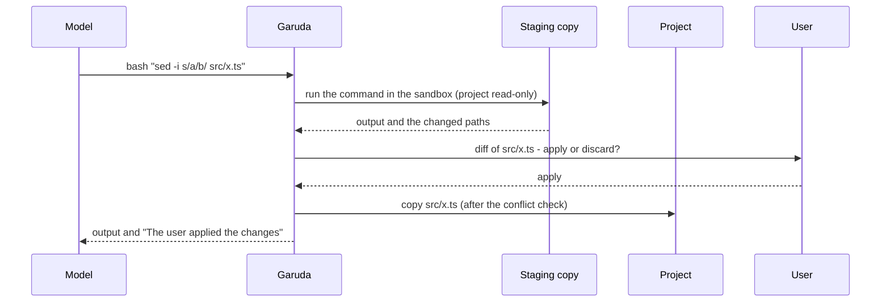

# Bounded changes (0.17, planned)

Status: the user approved this design (2026-10-10). Done: T7, the strict profile (patch 0184). The
rest is planned. This is the design for review tasks T5–T10 (external review of 0.16.1,
2026-10-10). The patch plan is at the end. Each section has decisions, a threat model, a default and
tests.

## Purpose

The review found one main gap: a command in the OS sandbox runs with no question, and it can change
any file in the project. Edits ask first, but a command such as `sed -i`, `npm install` or a build
script can change the same files with no diff and no yes. `/undo` can restore them later, but only
when undo is on, and only after the change.

The review also found five smaller gaps:

- A scheduled job's approval list limits the tools (`edit_file(src/**)`), but its commands can write
  anywhere in the worktree.
- A user cannot turn the host fallback off with one value. The team policy has `requireSandbox`,
  but without a sandbox Garuda still starts, and every command is then denied, one at a time.
- `/audit verify` does not detect lines cut from the end of a file, or a deleted file.
- Each subagent has its own token budget. Parallel children can spend more than the parent has left.
- Java and Python references come from identifier matches, not from resolved symbols. The model and
  the user do not know that.

## Summary

| Task | Change | Default | Where |
| --- | --- | --- | --- |
| T5 | Staged commands: a command writes to a staging copy; Garuda shows the change and asks; a no discards it. | Off. `"commands": { "mode": "staged" }`. | `src/sandbox/`, `src/permissions/`, `src/tools/bash.ts` |
| T6 | Job write scopes: a job's commands can write only in the folders that the user approved. | On for new jobs. An old job without a scope says "the whole worktree" in its approval text. | `src/jobs/`, `src/cli/jobCommand.ts` |
| T7 | Strict profile: OS sandbox required, no host fallback, no `outside_sandbox`. | Off. `"profile": "strict"` in a policy file or the project's settings. | `src/permissions/policy.ts`, `src/sandbox/index.ts`, `src/tools/bash.ts` |
| T8 | Audit threat model in the docs, and an optional checkpoint of each file's chain head. | Docs: always. Checkpoint: off. | `src/audit/logger.ts`, `/audit verify` |
| T9 | One token budget for the parent, its children, retries, compaction and the final answer. | On (same limits; children can no longer spend past them). | `src/loop/`, `src/agents/` |
| T10 | Java and Python references marked approximate; precision and recall measured. | On (labels only). | `src/knowledge/`, `src/tools/codeTools.ts` |

The rule "a feature without a measured gain is off by default" applies to T5, T7 and the T8
checkpoint. T6, T9 and T10 correct what an existing feature promises, so they are on.

## T5: staged commands (consent for command effects)

### Behaviour

With `"commands": { "mode": "staged" }`:

1. Garuda keeps a **staging copy** of the project for the session.
2. A command in the sandbox runs in the staging copy. The real project is read-only for the command.
3. After the command, Garuda lists what changed in the staging copy.
4. No change: no question. Most commands (tests, `git status`, `grep`, a build into an ignored
   folder) change nothing that Garuda shows, so they do not ask.
5. A change: Garuda shows the diff and asks: apply, or discard.
6. Apply: Garuda copies the changed files into the project; with undo on, `/undo` restores them. Discard:
   Garuda restores those files in the staging copy from the project. The project does not change.
7. The model gets the command's output and one line: "The user applied the changes" or "The user
   discarded the changes: the project did not change".

`outside_sandbox: true` is not staged: it asks first, as today. In `"mode": "direct"` (the default)
nothing changes.

### The staging copy

| Platform | Backend | Path that the command sees |
| --- | --- | --- |
| Linux, bubblewrap 0.9 or later, and a kernel that allows overlayfs in a user namespace (5.11 or later) | Overlay: `--overlay-src <root> --overlay <upper> <work> <root>`. Writes go to `upper`. | The project's own path. |
| Linux, other | A copy (`cp --reflink=auto`) in `~/.garuda/staging/`, bound at the project's path with `--bind`. | The project's own path. |
| macOS (APFS) | A clone (`clonefile`, `cp -c -R`) in `~/.garuda/staging/`. Seatbelt cannot move a path, so the command runs in the clone. | The clone's path. |

On all platforms the sandbox policy of a staged command has the real project in the read-only list.
A tool that writes to an absolute path in the project (a virtual environment, a link in
`node_modules`) fails with "Read-only file system" or "Operation not permitted". The change cannot
reach the project past the question.

The staging copy lives for the session. Build outputs in ignored folders stay in it, so the next
command sees them. Garuda's own edits (`edit_file`, `write_file`) go to the project after their
question, as today, and Garuda copies the same files into the staging copy before the next command.

### What the question shows

- Changed, added and deleted files that git does not ignore: a diff, as for an edit.
- Sensitive files (the list in `src/permissions/sensitive.ts`) by name, also when git ignores them.
- Other ignored files: one line per top folder with a count ("target/: 212 files"). These stay in
  the staging copy and are not applied (see open question Q1).

### Conflict check

Garuda records the hash of each changed path in the project before the command. Before it applies,
it checks the project again. A file that changed in between (the user edited it) is a conflict:
Garuda applies nothing and shows the paths. The staged change stays for one more question.

### Threat model

| Threat | Control |
| --- | --- |
| A command changes project files with no question. | The project is read-only for the command; only an apply copies files, after a yes. |
| A command writes through a link in the staging copy to the real project. | The real project is read-only in the sandbox policy, so the write fails. Garuda copies regular files only and refuses links that point outside the root. |
| A command hides a change in an ignored folder that a later host program runs (`node_modules/.bin`). | Ignored changes stay in the staging copy; they never reach the project in this design. |
| The diff hides text with control characters. | The same display as the edit question (hidden characters shown). |
| A large change hides one bad line. | The question shows the counts per file and allows "view"; per-file selection is open question Q2. |

### Costs and limits

- A clone or copy at the session start: measured before release on Garuda's own repository and on a
  20 000-file Java repository. Target: less than 2 s on APFS and with reflink. A plain copy over
  2 GB stops with a message and keeps `"mode": "direct"`.
- The list of changes uses the snapshot walk of `/undo` (`src/undo/snapshots.ts`): the same
  excludes and the 50 000-file limit.

### Tests

- A command writes a tracked file; the user discards; the project file is unchanged (negative
  control: in direct mode the file changes).
- The user applies; the project has the new content; with undo on, `/undo` restores it.
- A command writes to the real project's absolute path; it fails; the project is unchanged.
- A command deletes a file; the question lists the deletion; apply deletes it.
- A command that changes nothing: no question.
- An ignored build output stays in staging and the next command sees it; the project has none.
- A conflict: the user changes the file during the command; apply refuses.
- `outside_sandbox` still asks first and is not staged.
- Live test on macOS (clone) and Linux (overlay, and copy with an older bwrap).

### Decisions of the user (2026-10-10)

- **Q1.** Ignored files stay only in the staging copy. They are never applied.
- **Q2.** All or nothing first. Per-file selection can come later.
- **Q3.** On macOS the command runs at the clone's path. Staged mode works on macOS and Linux.

## T6: job write scopes

### Behaviour

A job file gets one new field, `writeScope`: a list of folders in the worktree, for example
`["src", "test", "target"]`.

- `/schedule` proposes the scope from the plan: the folders of the files that the plan names, plus
  the build output folders of the language profile (`target`, `build`, `.gradle`, `dist`). The
  approval question shows it.
- `garuda run` builds the sandbox policy with the worktree read-only and only the scope folders
  (and temp, caches, linked folders) writable.
- `edit_file` and `write_file` outside the scope are denied, also when an allow rule matches.
- After the turn, the job lists files changed outside the scope (for example by `git` itself). Any
  such file marks the job as failed with "changes outside the approved scope"; no commit.
- A job file without `writeScope` (created before 0.17) runs as today, and the run's first line says
  "Commands may write anywhere in the worktree."

### Why folders, not globs

bubblewrap binds folders. Seatbelt could take a regular expression, but the two platforms must
enforce the same scope. A folder list is what both can enforce, and what the user can read.

### Threat model

| Threat | Control |
| --- | --- |
| A job command changes a file that the user did not approve (CI config, a build script). | The OS sandbox refuses the write; the post-check catches any other path. |
| The model edits the job file to widen its scope. | The job file is in the checkout's `.garuda/jobs/`, outside the worktree; the job's commands cannot write there. |
| A scope of `.` | Refused: a scope entry is one or more folder names, not the root, not `..`, no link. |

### Tests

- A job command writes outside the scope; the write fails; the job reports it (negative control:
  without the scope the write succeeds).
- An edit outside the scope is denied with an allow rule present.
- An old job without `writeScope` runs and prints the whole-worktree line.
- Scope validation: `.`, `..`, absolute paths and links are refused.
- Live test job on macOS and Linux.

## T7: strict profile (done, 0184)

### Behaviour

`"profile": "strict"` in the managed policy, in `~/.garuda/policy.json`, or in the project's
`.garuda/settings.json`. A project can turn strict on, never off: the strictest source wins.

Strict means:

1. The executor must be the OS sandbox. Without one, Garuda stops at startup with the reason and
   the fix (install bubblewrap; or remove the strict profile). No host fallback, no "each command
   asks" mode. `executor: "host"` is an error.
2. The `bash` tool has no `outside_sandbox` parameter, so the model does not see it. A call that
   still sends it is denied.
3. `!command` in the chat runs in the sandbox only.
4. `garuda acp`: `session/new` fails with the same message, as a plain error (not "auth required").

As built: a strict policy also has `requireSandbox: true`. The strict `bash` schema rejects unknown
fields, so a call that still sends `outside_sandbox` fails the input check. See
[permissions.md](permissions.md#the-strict-profile-017).

Strict does not change the network rules or the edit questions.

### Threat model

| Threat | Control |
| --- | --- |
| A machine without a sandbox runs commands on the host after one tired yes. | No host executor and no `outside_sandbox` in strict mode. |
| A cloned project removes strict mode. | Only a policy file or the user can set it; a project can only add it. |

### Tests

- With a fake probe that finds no sandbox, strict startup exits with the message (negative control:
  without strict, Garuda starts with the host notice).
- The bash tool schema has no `outside_sandbox` in strict mode.
- A project file with `"profile": "default"` does not turn off a policy's strict.

## T8: audit threat model and checkpoint

### What `/audit verify` detects (docs, always)

| Change to a log file | Detected today | With the checkpoint |
| --- | --- | --- |
| A line changed | Yes | Yes |
| A line inserted or removed in the middle | Yes | Yes |
| Lines cut from the end | No | Yes, back to the last checkpoint |
| A whole file deleted | No | Yes, when the checkpoint lists it |
| The whole chain rewritten by someone with the user's rights | No | No, unless the checkpoint is outside the user's reach (a command, below) |

A sandboxed command cannot write `~/.garuda`, so the agent's own commands cannot change the log.
The user, and any program that runs as the user, can.

### Checkpoint

With `"audit": { "checkpoint": true }` (policy files only):

- After each line, Garuda writes the file name, `seq` and `hash` to
  `~/.garuda/audit/<project>-<hash>/checkpoint.json` (atomic write, 0600).
- With `"audit": { "checkpointCommand": "..." }`, Garuda also sends the head to the team's own
  command (for example a log shipper) at the end of each turn. That copy is outside the user's reach.
- `/audit verify` compares each file with its checkpoint: fewer lines, a different head hash, or a
  missing file is a failure, with the file name.

### Tests

- Cut the last line; verify with the checkpoint reports it (negative control: without the
  checkpoint, verify says "ok").
- Delete a file; verify reports the missing file.
- The checkpoint file holds no target or reason text.

## T9: one token budget for the agent tree

### Today

The parent's `tokenBudget` counts its own calls, and adds a child's usage after the child ends. Each
child has its own budget (150 000 by default), whatever the parent has left. Two parallel children
can each spend their full budget when the parent has less left.

### Design

A `Budget` object, made per turn and shared by the parent and all its children:

- `reserve(tokens)` before each model call: context tokens plus `maxTokens`. Not enough left: no
  call, and the run stops with `token_budget`.
- `settle(reservation, used)` after the call returns the unused part.
- A child gets `min(its own limit, what is left)`. JavaScript runs one reservation at a time, so
  parallel children cannot both take the same tokens.
- Retries, compaction and the child's wrap-up call reserve in the same way.
- The parent keeps a floor for its own final answer (context tokens plus `maxTokens` of its last
  call). A child cannot reserve into that floor.

### Tests

- Three parallel children with a small parent budget: the sum stays inside the cap (negative
  control: today the sum goes over).
- A child stops early and its unused tokens return to the parent.
- The parent still gets its final answer when the children used the rest.

## T10: approximate code-intelligence results

### Behaviour

- `ReferenceHit` gets `exact: boolean`. TypeScript references (from the compiler) are exact. Java and
  Python references (identifier matches) are not.
- `find_references`, `find_callers` and `impact_analysis` start their output with one line when any
  hit is approximate: "Approximate: these are name matches, not resolved symbols. Check each one."
- The chat shows `≈` before approximate results.

### Measurement

A fixed sample: 30 symbols in the generated shopkit Java project and 30 in a Python sample. The
ground truth comes from a language server (jdtls, pyright), recorded once as a JSON fixture. Garuda
publishes precision and recall per language in the validation record. A test fails when the numbers
drop below the recorded values.

### Tests

- Java and Python hits carry `exact: false`; TypeScript hits carry `exact: true`.
- The tool output has the approximate line only when needed.

## Docs to change with each patch

CHANGELOG; this file (status); `docs/architecture.md` and `docs/hld.md` rows; `docs/lld/sandbox.md`
(T5), `jobs.md` (T6), `permissions.md` (T7), `agents.md` and `runtime-and-loop.md` (T9),
`knowledge.md` (T10); the site's security page (T5, T7, T8). Each public text keeps the exact
claims from T1.

## Patch plan

| Patch | Task | Content |
| --- | --- | --- |
| 0183 | T4 | This design, the architecture and HLD rows (planned). |
| 0184 | T7 | Strict profile. |
| 0185 | T8 | Audit docs and the checkpoint. |
| 0186 | T10 | Approximate labels; the measured numbers. |
| 0187 | T9 | The shared budget. |
| 0188 | T6 | Job write scopes. |
| 0189 | T5 | Staging backends and the change list (no question yet). |
| 0190 | T5 | The question, apply, discard, conflict check, undo. |
| 0191 | T5 | Docs, the live tests on macOS and Linux, the measured costs. |

The order puts the small, independent changes first. T5 comes last.
