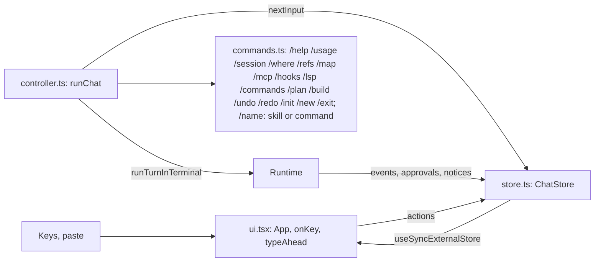

# CLI and chat (`src/cli/`)

## Purpose

Parse the command line, run the chosen mode, show agent events, and ask the user for approvals.
The CLI owns the terminal. Nothing below it writes to the terminal directly.

## Files

| File | Role |
| --- | --- |
| `index.ts` | Entry point (commander). Modes: chat, `-p`, stdin task, `--resume`, `--replay`, `eval`, `init` (the chat with `/init` as the first line, `firstInput`). With no first line, the banner gets `initTip` (see [init.md](init.md)). |
| `turn.ts` | `runTurnInTerminal`: one turn with Ctrl-C handling, usage line and stop message. |
| `repl.ts` | Plain chat (readline). Used for pipes, `GARUDA_PLAIN=1`, and the single binary. |
| `renderer.ts` | `Renderer` interface and `PlainRenderer`: model text to stdout, activity to stderr. |
| `approver.ts` | `TerminalApprover` (inquirer select), `SwitchApprover`, shared `header` and `colorPreview`. |
| `report.ts` | Usage line and stop messages. |
| `jsonOutput.ts` | `-p --output-format json\|stream-json` (0.5): `JsonOutput` (a `Renderer`) and the pure `initLine`, `assistantLine`, `resultLine`. See below. |
| `banner.ts` | The chat start banner: GARUDA wordmark (saffron-to-gold gradient on true-color terminals), a card with version, model, sandbox, folder and extras (the detected build tools first, for example `Java (Maven)`), and a tips line. The card only below 60 columns; no colors with `NO_COLOR` or a pipe. Not shown for `-p`. |
| `errors.ts` | `describeError`: the error chain as one message. |
| `evalCommand.ts` | `garuda eval`: options, toolchain check before the run, `--prepare java\|python`, `--subagents on\|off`, `--subagent-model`, `--todo on\|off`, `--lsp on\|off` (checks for a server and the sandbox first), executor choice, run, report files. |
| `lspCommand.ts` | `garuda lsp` (the state; starts no server) and `garuda lsp install typescript\|python\|java`. See [lsp.md](lsp.md). |
| `chat/*` | The Ink chat (below). |

## Start sequence (`index.ts`)

1. `realpath(cwd)` becomes the root. A task comes from `-p` or from stdin when stdin is not a TTY.
2. `Runtime.create` with a `SwitchApprover` (wraps `TerminalApprover`) and a switchable event target
   (starts as `PlainRenderer`). `onNotice` goes to the same target.
3. Exit handlers: `process.on("exit")` calls `executor.shutdown()`, so no command or server outlives Garuda.
4. `-p`: one `runTurnInTerminal`, then `runtime.close()`. Exit code: 0 done, 1 error, 2 limit (or the
   model's own max_tokens or refusal stop), 130 Ctrl-C. The exit codes are the same for all output formats.
5. Chat: if stdin and stdout are TTYs, `GARUDA_PLAIN` is not `1` and `TERM` is not `dumb`, load
   `chat/inkChat.js` with `import()`. If the import fails (the single binary), use the plain REPL.

## JSON output (`jsonOutput.ts`, 0.5)

`--output-format text|json|stream-json` works only with a task (`-p` or stdin). The field names are those
of Claude Code's headless mode (checked against the `@anthropic-ai/claude-agent-sdk` types), so scripts
for `claude -p --output-format …` read Garuda too.

- stdout holds only JSON, one object per line. The model text never goes there: `JsonOutput` sends events
  to a `PlainRenderer` whose stdout is a null stream. stderr gets warnings and errors; `--verbose` adds the
  tool activity and the usage line. (Claude Code needs `--verbose` for stream-json; Garuda does not.)
- `json`: one `result` line at the end.
- `stream-json`, in order:

| Line | When | Main fields |
| --- | --- | --- |
| `system/init` | before the first other line | `cwd`, `tools`, `mcp_servers` (`name`, `status`), `model`, `permissionMode` (`default` or `plan`), `slash_commands`, `apiKeySource`, `garuda_version` |
| `assistant` | each model response (`step_end`) | `message`: an Anthropic Messages API message with all blocks (`text`, `tool_use`), `stop_reason`, `usage` |
| `user` | each tool result | `message.content`: one `tool_result` block (`tool_use_id`, `content`, `is_error`) |
| `system/api_retry` | a broken stream is sent again | `attempt`, `max_retries`, `retry_delay_ms`, `message` |
| `system/compact_boundary` | compaction | `compact_metadata`: `trigger: "auto"`, `pre_tokens`, `post_tokens` |
| `result` | last | see below |

Every line has `session_id` and `uuid`; `parent_tool_use_id` is `null` (subagent steps are not streamed).

The `result` line: `subtype`, `is_error`, `duration_ms`, `duration_api_ms`, `num_turns` (model calls),
`result` (the last response's text, success only), `stop_reason`, `total_cost_usd` (the session total; 0
when the price is unknown), `usage` (this run), `modelUsage` (one entry for the main model; subagent use is
included in it), `permission_denials`, `errors` (error subtypes), `terminal_reason`.

| Garuda stop | `subtype` | `terminal_reason` |
| --- | --- | --- |
| done, max_tokens, refusal | `success` | `completed` |
| max_steps | `error_max_turns` | `max_turns` |
| token_budget | `error_during_execution` (the budget counts tokens, not dollars) | `budget_exhausted` |
| repeated_calls | `error_during_execution` | – |
| an error | `error_during_execution`, `is_error: true` | – |
| Ctrl-C | `error_during_execution`, errors `["Interrupted."]` | – |

Not in 0.5: `--input-format stream-json`, `--include-partial-messages` (`stream_event` lines), `--json-schema`.

commander uses `enablePositionalOptions()`, so options after `eval` belong to `eval` (`garuda eval -m x`).

## Ctrl-C (`turn.ts`)

`runTurnInTerminal(runtime, interruptible, renderer, prompt, exitNow)`:

- It creates an `AbortController` for the turn and sets `interruptible.onInterrupt = stop`.
- First Ctrl-C: prints "Stopping…" and aborts. The executor kills the command's process group.
- Second Ctrl-C during the same turn: `exitNow()` (exit 130).
- On abort it records `end: interrupted` in the journal; on an error, `end: error`.

## Plain renderer

- Model text: stdout, as it streams. Everything else: stderr, on a new line.
- Tool lines: `● name summary` and `⎿ result summary` (`summariseCall`, `summariseResult`). For MCP
  results the summary skips the `<mcp_result …>` line.
- Colors only when stderr is a TTY and `NO_COLOR` is not set.

Retry notices: a `model_retry` event prints "The connection to the model broke (terminated). Retrying
(1/2)…" as a warning. The Ink chat also drops the text that streamed but did not finish a block, because
the request goes again.

## Terminal approver

- Header by target kind: command (with sandbox state), path (`wants to change`), URL (`wants to fetch
  from <host>`), input, or the request's own `title`.
- Choices: once, session, deny; the request can show fewer (`choices`), give its own labels (`labels`)
  and its own question (`question`, default "Allow?"; for example "Build this plan?", "Install it?").
- No TTY on stdin: deny, with a message.
- inquirer loads on first use (N3). Ctrl-C inside the prompt calls `onInterrupt`.

## Ink chat (`chat/`)



| File | Role |
| --- | --- |
| `inkChat.ts` | Entry. Creates the store, sets it as approver and event target, renders `App`, runs `runChat`, unmounts. Never awaits `waitUntilExit()` (it hangs after unmount). |
| `store.ts` | `ChatStore`: all chat state and logic. Implements `Renderer`, `Approver` and `Interruptible`. |
| `controller.ts` | `runChat`: next line → command or turn; `statusOf` for the footer. |
| `ui.tsx` | Ink view: `<Static>` for finished items, a small live area, the key map. |
| `lineEditor.ts` | Pure line editor: insert, delete, words, kill, history with draft. |
| `markdown.ts` | `takeBlocks` (split a stream at blank lines, not inside fences) and `renderMarkdown`. |
| `commands.ts` | Slash commands, shared with the plain REPL. |

### ChatState

```ts
interface ChatState {
  items: Item[];            // printed once: user, text, tool, note, output
  streaming: string;        // the open text block, plain
  running: RunningTool[];   // spinner lines
  approval?: PendingApproval; // request, choices (with labels), selected
  queue: string[];          // type-ahead
  editor: EditorState;
  busy: boolean;
  status: Status;           // model, sandbox, context %, cost
  exiting: boolean;
}
```

### Behaviour

- **Text:** `text_delta` appends to `streaming`; `takeBlocks` moves finished blocks to `items`, styled
  with `renderMarkdown`. A tool call, a step end or a note flushes the open block.
- **Tools:** `tool_call` adds a running line; `tool_result` prints the call and result lines and keeps
  the full output for Ctrl-O. A `todo_write` result also prints its checklist (`✔` done, `▶` in
  progress, `○` pending); the plain renderer prints the same lines.
- **Plan mode (0.4):** `/plan` and `/build` switch the mode (both chats); Shift+Tab toggles it in the
  Ink chat (`store.onToggleMode`, set by the controller); `garuda --plan` starts in plan mode. The footer
  shows a yellow `PLAN`; the plain chat's prompt is `plan›`. The switch applies from the next turn. After a
  plan turn that ends with `done`, `planHandoff` asks "Build this plan?": *Yes, build it now* switches to
  build mode and runs "Carry out the plan above." as the next turn; *Switch to build mode; I will type the
  task* only switches; *No* stays in plan mode. `-p` never asks.
- **Custom commands (0.4):** a line that starts with `/` goes to `runCommand`; a custom command gives
  back its prompt, the chat shows the typed line once and runs the turn with the prompt. See
  [commands.md](commands.md).
- **Approvals:** `ask()` prints the full header and preview into the scrollback, then shows the request's
  question and choices. Keys: ↑↓ Enter, the numbers of the choices shown, y / a / n, Esc (`approvalKeys`
  writes the hint line). A key for a choice that is not shown does nothing. Abort of the turn rejects the
  promise.
- **MCP (0.4):** `/mcp` shows each server (remote ones with their URL and sign-in state); `/mcp logout
  <server>` removes a remote server's tokens. See [mcp.md](mcp.md).
- **Undo (0.4):** `/undo` and `/redo` ask first (the turn, the files, the conversation), then restore. See
  [undo.md](undo.md).
- **Init (0.5):** `/init` runs `Runtime.init` (migration and git init, with questions), prints the
  report and returns the init turn's prompt. `garuda init` queues `/init` with `store.enqueue` (the plain
  REPL takes it as its first line). See [init.md](init.md).
- **LSP (0.4):** `--lsp` turns diagnostics on for the run; `/lsp` shows the state, and
  `/lsp install <language>` runs the managed install. See [lsp.md](lsp.md).
- **Queue:** Enter while busy appends to `queue`; `nextInput()` takes from the queue first. Esc clears it.
- **Type-ahead at start:** keys typed before raw mode arrive as one chunk with `\n` (cooked mode);
  `typeAhead` treats each line end as Enter. Bracketed paste (`usePaste`) inserts text and never submits.
- **Ctrl-C:** busy → `onInterrupt`; idle with text → clear the line; idle and empty → exit on a second
  press within 2 s. Ctrl-D on an empty line exits.

## Tests

`test/chat.test.tsx` (markdown, editor, store, type-ahead, Ink integration with `ink-testing-library`),
`test/m5.acceptance.test.ts` (plain chat and `-p`), `test/cli.test.ts`. The cloud workspace also
drives the Ink chat in a real pseudo-terminal for smoke tests.
