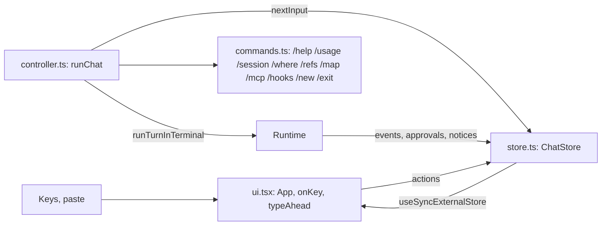

# CLI and chat (`src/cli/`)

## Purpose

Parse the command line, run the chosen mode, show agent events, and ask the user for approvals.
The CLI owns the terminal. Nothing below it writes to the terminal directly.

## Files

| File | Role |
| --- | --- |
| `index.ts` | Entry point (commander). Modes: chat, `-p`, stdin task, `--resume`, `--replay`, `eval`. |
| `turn.ts` | `runTurnInTerminal`: one turn with Ctrl-C handling, usage line and stop message. |
| `repl.ts` | Plain chat (readline). Used for pipes, `GARUDA_PLAIN=1`, and the single binary. |
| `renderer.ts` | `Renderer` interface and `PlainRenderer`: model text to stdout, activity to stderr. |
| `approver.ts` | `TerminalApprover` (inquirer select), `SwitchApprover`, shared `header` and `colorPreview`. |
| `report.ts` | Usage line and stop messages. |
| `errors.ts` | `describeError`: the error chain as one message. |
| `evalCommand.ts` | `garuda eval`: options, executor choice, run, report files. |
| `chat/*` | The Ink chat (below). |

## Start sequence (`index.ts`)

1. `realpath(cwd)` becomes the root. A task comes from `-p` or from stdin when stdin is not a TTY.
2. `Runtime.create` with a `SwitchApprover` (wraps `TerminalApprover`) and a switchable event target
   (starts as `PlainRenderer`). `onNotice` goes to the same target.
3. Exit handlers: `process.on("exit")` calls `executor.shutdown()`, so no command or server outlives Garuda.
4. `-p`: one `runTurnInTerminal`, then `runtime.close()`. Exit code: 0 done, 1 error, 2 limit, 130 Ctrl-C.
5. Chat: if stdin and stdout are TTYs, `GARUDA_PLAIN` is not `1` and `TERM` is not `dumb`, load
   `chat/inkChat.js` with `import()`. If the import fails (the single binary), use the plain REPL.

commander uses `enablePositionalOptions()`, so options after `eval` belong to `eval` (`garuda eval -m x`).

## Ctrl-C (`turn.ts`)

`runTurnInTerminal(runtime, interruptible, renderer, prompt, exitNow)`:

- It creates an `AbortController` for the turn and sets `interruptible.onInterrupt = stop`.
- First Ctrl-C: prints "Stopping…" and aborts. The executor kills the command's process group.
- Second Ctrl-C during the same turn: `exitNow()` (exit 130).
- On abort it records `end: interrupted` in the journal; on an error, `end: error`.

## Plain renderer

- Model text: stdout, as it streams. Everything else: stderr, on a new line.
- Tool lines: `● name summary` and `⎿ result summary` (`summariseCall`, `summariseResult`). For MCP
  results the summary skips the `<mcp_result …>` line.
- Colors only when stderr is a TTY and `NO_COLOR` is not set.

## Terminal approver

- Header by target kind: command (with sandbox state), path (`wants to change`), URL (`wants to fetch
  from <host>`), input, or the request's own `title`.
- Choices: once, session, deny; labels can come from the request (`labels`).
- No TTY on stdin: deny, with a message.
- inquirer loads on first use (N3). Ctrl-C inside the prompt calls `onInterrupt`.

## Ink chat (`chat/`)



| File | Role |
| --- | --- |
| `inkChat.ts` | Entry. Creates the store, sets it as approver and event target, renders `App`, runs `runChat`, unmounts. Never awaits `waitUntilExit()` (it hangs after unmount). |
| `store.ts` | `ChatStore`: all chat state and logic. Implements `Renderer`, `Approver` and `Interruptible`. |
| `controller.ts` | `runChat`: next line → command or turn; `statusOf` for the footer. |
| `ui.tsx` | Ink view: `<Static>` for finished items, a small live area, the key map. |
| `lineEditor.ts` | Pure line editor: insert, delete, words, kill, history with draft. |
| `markdown.ts` | `takeBlocks` (split a stream at blank lines, not inside fences) and `renderMarkdown`. |
| `commands.ts` | Slash commands, shared with the plain REPL. |

### ChatState

```ts
interface ChatState {
  items: Item[];            // printed once: user, text, tool, note, output
  streaming: string;        // the open text block, plain
  running: RunningTool[];   // spinner lines
  approval?: PendingApproval; // request, choices (with labels), selected
  queue: string[];          // type-ahead
  editor: EditorState;
  busy: boolean;
  status: Status;           // model, sandbox, context %, cost
  exiting: boolean;
}
```

### Behaviour

- **Text:** `text_delta` appends to `streaming`; `takeBlocks` moves finished blocks to `items`, styled
  with `renderMarkdown`. A tool call, a step end or a note flushes the open block.
- **Tools:** `tool_call` adds a running line; `tool_result` prints the call and result lines and keeps
  the full output for Ctrl-O.
- **Approvals:** `ask()` prints the full header and preview into the scrollback, then shows only the
  choice. Keys: ↑↓ Enter, 1 2 3, y / a / n, Esc. Abort of the turn rejects the promise.
- **Queue:** Enter while busy appends to `queue`; `nextInput()` takes from the queue first. Esc clears it.
- **Type-ahead at start:** keys typed before raw mode arrive as one chunk with `\n` (cooked mode);
  `typeAhead` treats each line end as Enter. Bracketed paste (`usePaste`) inserts text and never submits.
- **Ctrl-C:** busy → `onInterrupt`; idle with text → clear the line; idle and empty → exit on a second
  press within 2 s. Ctrl-D on an empty line exits.

## Tests

`test/chat.test.tsx` (markdown, editor, store, type-ahead, Ink integration with `ink-testing-library`),
`test/m5.acceptance.test.ts` (plain chat and `-p`), `test/cli.test.ts`. The cloud workspace also
drives the Ink chat in a real pseudo-terminal for smoke tests.
