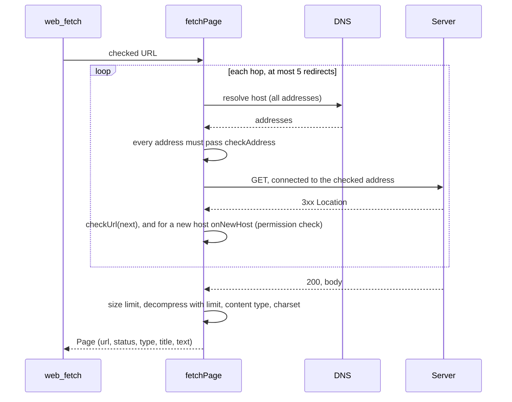

# Web fetch and web search (`src/web/`, `src/net/`, `src/tools/webFetch.ts`, `src/tools/webSearch.ts`)

## Purpose

Read one web page as Markdown for the model, with approval per host and protection against
server-side request forgery (SSRF) and data leaks through URLs.

## Files

| File | Role |
| --- | --- |
| `net/address.ts` | `checkAddress(ip, allowLocalhost)`, `isIpLiteral`, `isLoopbackHost` (ipaddr.js). Shared with the model providers. |
| `web/fetch.ts` | `checkUrl`, `fetchPage`, `htmlToMarkdown`, `decodeEntities`, `FetchError`. |
| `tools/webFetch.ts` | The `web_fetch` tool: approval target, paging, cache, output. |
| `web/search.ts` | Web search (0.5): `loadSearchConfig`, `search` (Brave, Tavily, SearXNG), `parseResults`. |
| `tools/webSearch.ts` | The `web_search` tool: approval, the secret check, `resultsText`. |
| `model/serverTools.ts` | Claude's web search (0.6): neutral text for server search blocks (`serverCallText`, `serverResultSummary`, `withoutServerBlocks`). |

## URL check (`checkUrl`)

1. Parse with WHATWG `URL`. Only `http:` and `https:`.
2. Refuse a user name or password in the URL.
3. `http:` becomes `https:`, except for loopback hosts when `web.allowLocalhost` is on.
4. An IP literal must pass `checkAddress`. The URL parser already turns forms like `0x7f000001` into
   `127.0.0.1`.
5. Drop the fragment.

## Address check (`checkAddress`)

`ipaddr.process()` parses the address (IPv4-mapped IPv6 becomes IPv4). Only the range `unicast` passes;
`loopback` passes only with `allowLocalhost`. Everything else is refused: private, link-local (cloud
metadata `169.254.169.254`), unique local, carrier-grade NAT, unspecified, multicast, reserved.

## Fetch (`fetchPage`)



- The custom `lookup` function resolves once, refuses the host if any address fails, and hands exactly
  those addresses to the socket. So DNS rebinding between the check and the connection is not possible.
  TLS still checks the certificate against the host name.
- Request: `GET`, `agent: false`, no cookies, no credentials, no proxy. Headers: a Garuda user agent,
  `accept` for HTML, Markdown, text and JSON, `accept-encoding: gzip, deflate, br`.
- Limits: 30 s for the whole fetch; 5 MB declared, and 5 MB counted after decompression (stops gzip bombs).
- Status other than 2xx: error. Content types: `text/html`, `text/plain`, `text/markdown`, `text/csv`,
  `text/xml`, JSON, XML, XHTML, RSS, Atom (or none). Others: error.
- HTML: remove comments and `script`, `style`, `noscript`, `template`, `iframe`, `svg`, `canvas`, `nav`,
  `footer`, `aside`, `form`, `button`, `select`, `object`, `embed`; then node-html-markdown (loaded with
  `import()`). The title is taken from `<title>` with entities decoded; in the output header it is
  cleaned and tag-neutralized (0.14, review), so a title holding `</web_result>` cannot fake the
  boundary.

## Tool (`web_fetch`)

Input: `url`, `start` (character offset, default 0), `max_chars` (1 000–100 000, default 30 000).

- `describe()`: `checkUrl`, then target `{ kind: "url", url, host: hostname }`. An unusual URL (longer than
  300 characters, with a token of 64 or more characters in the path or query, or since 0.14.1 a host
  label of 32 or more characters or a host name over 100 characters) sets `alwaysAsk`: the
  engine then ignores allow and session rules. Preview: `GET <url>`, the original URL if it changed, and
  a warning for unusual URLs.
- Approval per host: "Yes, allow <host> for this session" adds a host-exact session rule. Rules:
  `web_fetch(docs.python.org)`, `web_fetch(*.github.com)`.
- A redirect to another host calls `permissions.check` for that host, with the preview "a redirect from …".
- Cache: 10 minutes per URL, so paging with `start` does not fetch again. At most `CACHE_MAX_PAGES`
  (50) pages: expired pages go first, then the oldest (0.14.1, review: the cache never evicted).
- Output: `<web_result url=… type=… title=…>` (url, type and title cleaned and tag-neutralized),
  `[characters a–b of n]`, the cleaned text part (tags neutralized), `[More: call web_fetch again with
  start=b]` when more is left, `</web_result>`.

## Settings

`"web": { "enabled": true, "allowLocalhost": false }`. `enabled: false` removes the tool. The evals turn it off.

## Limits

No HTTP proxy support yet (corporate networks). Only GET. Text types only.

## Web search (0.5)

### Backends

| Backend | Call | Key | Results |
| --- | --- | --- | --- |
| Brave Search | `GET https://api.search.brave.com/res/v1/web/search?q=…&count=N` | `X-Subscription-Token`, from `BRAVE_API_KEY` | `web.results[]`: title, url, description, age |
| Tavily | `POST https://api.tavily.com/search` `{query, max_results, search_depth: "basic"}` | `Authorization: Bearer`, from `TAVILY_API_KEY` | `results[]`: title, url, content |
| SearXNG | `GET <url>/search?q=…&format=json` | none (your own server; the JSON format must be on) | `results[]`: title, url, content, publishedDate |

### Config

Only the user configures search: `~/.garuda/search.json`, or a key in the environment. A project cannot
(queries would leave the machine to a place the repo picks).

```json
{ "provider": "brave" }
{ "provider": "tavily", "apiKeyEnv": "MY_TAVILY_KEY", "maxResults": 3 }
{ "provider": "searxng", "url": "http://localhost:8888" }
```

- Without the file: `BRAVE_API_KEY` picks Brave, else `TAVILY_API_KEY` picks Tavily, else no search.
- Keys come only from environment variables (`apiKeyEnv` names another one). A key in the file is an error.
- SearXNG: https, or http for this machine only; no user:password in the URL.
- A file or key problem gives one warning at start ("Web search is off: …"); Garuda runs on.

### The call

- 20 s time limit, 2 MB answer limit, no redirects. Errors say what to do: 401/403 "Check the API key",
  429 "Too many searches", no JSON from SearXNG "turn on the json format".
- Results with a URL that is not http(s) are dropped. At most 10 results (default 5).

### Tool (`web_search`)

Only when a backend is set and `web.enabled` is not false. Input: `query` (2–400 characters), `max_results`
(1–10). Not read-only: the query leaves the machine.

- Approval: the target is `input` with the query; the header is "web_search wants to search the web:"
  (`CallInfo.title`), and the preview shows the query and the backend. "Yes, for
  this session" allows all later searches in the session; the rule `web_search` in `permissions.allow`
  allows them for good. Plan mode allows a search only with that rule (it never asks), like web_fetch.
- A query with a run of 40 or more letters, digits or `+/_=-` is refused before the question: it could be a
  key or token from the session.
- Output: `<web_result search="…">`, then per result `N. title`, the URL (and age), and the snippet (HTML
  tags removed, entities decoded, cleaned, Garuda's markers neutralized, at most 500 characters), then
  `</web_result>` and "Read a page with web_fetch before you rely on it."
- The system prompt gets two lines: results are untrusted; no code, secrets or file contents in queries.

### Claude's web search (0.6)

Claude's search tool runs on Anthropic's servers, inside the model's reply. It is a second backend, only
for Claude models.

- **Config.** A `claude` section in `~/.garuda/search.json` (user only): `maxUses` (1–20, default 5),
  `allowedDomains` or `blockedDomains` (bare domains, optional path, not both). `provider` becomes
  optional: without it, the fallback comes from `BRAVE_API_KEY`/`TAVILY_API_KEY`. A broken fallback gives
  a warning and keeps Claude's search. `loadSearchConfig` returns `{ config?, claude?, use?, problem? }`.
- **Choice (0.14).** `use` in search.json (`SEARCH_USES`: claude, provider, off) is the user's consent, so
  nothing asks: `claude` turns Claude's search on for every session, `provider` keeps only the client
  tool, `off` registers no `web_search`. `saveSearchUse(home, use)` writes it and keeps the other keys
  (a broken file is not overwritten). `RuntimeOptions.search.use` and `.home` come from the CLI; evals
  and tests pass neither.
- **Consent without a saved choice.** Garuda cannot ask per query. `Runtime.claudeSearchTools()` asks
  once, before the first turn whose model can run it: "Allow Claude's web search?" The preview says the
  question comes before any task and does not mean the task will search, and gives the limit and the
  price; the choices are "Yes, Claude may search when needed" and "No, use my other search provider" (or
  "No, no web search"). With a home folder the answer is saved as `use` (yes → claude, no → provider or
  off), so it is not asked again; without one it holds until `/new` or `/sessions <n>`. Models that cannot
  run it (`ModelClient.serverTools`) never ask.
- **/search (0.14).** `Runtime.searchStatus()` (now, saved, available) and `Runtime.setSearch(use, save)`:
  this session only, or also saved. `off` unregisters the client `web_search`; `claude` and `provider`
  register it again when a provider is set up.
- **Request.** `ModelRequest.serverTools: [{ type: "web_search", maxUses, allowedDomains?, blockedDomains? }]`.
  The Anthropic adapter sends `web_search_20250305` after the client tools (the cache mark moves to it).
  Dynamic filtering (20260209+, with code execution) waits for an A/B eval. A server tool replaces the client
  tool of the same name in that request (`runAgent`), so the model sees one `web_search`.
- **Response.** `server_tool_use` → `ServerToolUseBlock`; `web_search_tool_result` → `ServerToolResultBlock`
  (titles, URLs, page age, or an error code). Both keep the API block in `wire` and go back to the API
  exactly as they came (the results hold `encrypted_content`). Text citations stay on the text block
  (`citations`) and go back too. `usage.server_tool_use.web_search_requests` → `Usage.webSearches`;
  `costOf` adds $0.01 per search.
- **pause_turn.** A long search can pause the turn: the loop sends the conversation again (the paused
  assistant message last), and the model goes on. It counts as a step.
- **Elsewhere.** The loop emits a `server_tool` event (chat: `● web_search (Claude) <query>` and
  `⎿ 5 results`; Ctrl-O lists the pages). Compaction turns old searches into text (titles and URLs) and drops
  their citations; other providers (after `/models`) get the same text. The Redactor leaves
  `encrypted_content` and `encrypted_index` alone (ciphertext); a stored block that redaction changed
  anyway becomes text on resume, so the API does not refuse it. JSON output shows the API blocks and
  `server_tool_use` usage, as Claude Code does; `/export` lists each search with its pages.
- **Agents.** A custom agent whose tools allow `web_search` (Claude Code name `WebSearch`) gets the server
  tool when Claude's search is on for the session and the agent's model can run it; the consent lists it
  as `web_search (Claude)`. Explore does not.

Garuda does not check the query before the search (it cannot see it in time); the prompt line says to
keep code and secrets out of queries, and the user agrees to that trade at the session question.

## Tests

`test/claudeSearch.test.ts` (0.6): the adapter (tool definition, blocks in and out unchanged, citations,
errors, pause_turn, search count), cost, the loop (replacing the client tool, pause_turn, events), compaction,
other providers, redaction and resume, JSON output, `/export`, the config, the session question, agents,
`/usage`. `test/webSearch.test.ts`: the config (environment keys, the file, keys only from the environment, SearXNG
URL rules, bad JSON); each backend's request and parsing with a fake fetch; error messages; the size limit;
the output (tags, entities, markers, snippet cap); the secret check; the runtime (the question with the
query, a session answer, a No sends nothing, plan mode with and without the rule, `web.enabled: false`).

`test/webFetch.test.ts` with a local HTTP server and a fake DNS resolver: address ranges, URL rules,
private DNS answers, loopback without the setting, HTML to Markdown, gzip, a compression bomb, content
types, 404, same-host and new-host redirects, a redirect to the metadata address, a redirect loop, rules,
unusual URLs, paging, tag neutralizing, per-host approval, allow and deny rules, and the cache.
