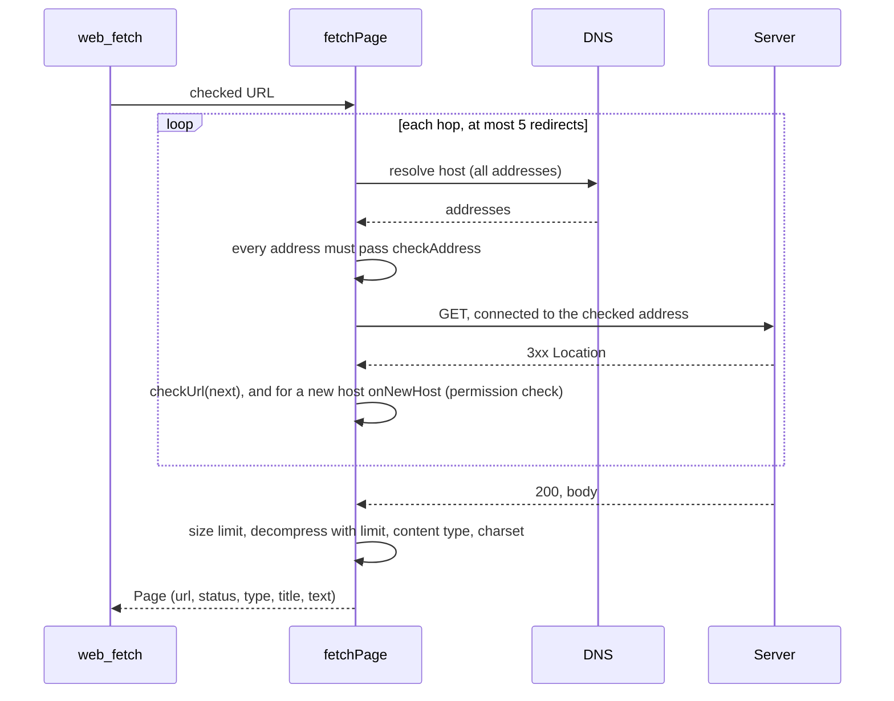

# Web fetch (`src/web/`, `src/net/`, `src/tools/webFetch.ts`)

## Purpose

Read one web page as Markdown for the model, with approval per host and protection against
server-side request forgery (SSRF) and data leaks through URLs.

## Files

| File | Role |
| --- | --- |
| `net/address.ts` | `checkAddress(ip, allowLocalhost)`, `isIpLiteral`, `isLoopbackHost` (ipaddr.js). Shared with the model providers. |
| `web/fetch.ts` | `checkUrl`, `fetchPage`, `htmlToMarkdown`, `decodeEntities`, `FetchError`. |
| `tools/webFetch.ts` | The `web_fetch` tool: approval target, paging, cache, output. |

## URL check (`checkUrl`)

1. Parse with WHATWG `URL`. Only `http:` and `https:`.
2. Refuse a user name or password in the URL.
3. `http:` becomes `https:`, except for loopback hosts when `web.allowLocalhost` is on.
4. An IP literal must pass `checkAddress`. The URL parser already turns forms like `0x7f000001` into
   `127.0.0.1`.
5. Drop the fragment.

## Address check (`checkAddress`)

`ipaddr.process()` parses the address (IPv4-mapped IPv6 becomes IPv4). Only the range `unicast` passes;
`loopback` passes only with `allowLocalhost`. Everything else is refused: private, link-local (cloud
metadata `169.254.169.254`), unique local, carrier-grade NAT, unspecified, multicast, reserved.

## Fetch (`fetchPage`)

- The custom `lookup` function resolves once, refuses the host if any address fails, and hands exactly
  those addresses to the socket. So DNS rebinding between the check and the connection is not possible.
  TLS still checks the certificate against the host name.
- Request: `GET`, `agent: false`, no cookies, no credentials, no proxy. Headers: a Garuda user agent,
  `accept` for HTML, Markdown, text and JSON, `accept-encoding: gzip, deflate, br`.
- Limits: 30 s for the whole fetch; 5 MB declared, and 5 MB counted after decompression (stops gzip bombs).
- Status other than 2xx: error. Content types: `text/html`, `text/plain`, `text/markdown`, `text/csv`,
  `text/xml`, JSON, XML, XHTML, RSS, Atom (or none). Others: error.
- HTML: remove comments and `script`, `style`, `noscript`, `template`, `iframe`, `svg`, `canvas`, `nav`,
  `footer`, `aside`, `form`, `button`, `select`, `object`, `embed`; then node-html-markdown (loaded with
  `import()`). The title is taken from `<title>` with entities decoded.

## Tool (`web_fetch`)

Input: `url`, `start` (character offset, default 0), `max_chars` (1 000–100 000, default 30 000).

- `describe()`: `checkUrl`, then target `{ kind: "url", url, host: hostname }`. An unusual URL (longer than
  300 characters, or with a token of 64 or more characters in the path or query) sets `alwaysAsk`: the
  engine then ignores allow and session rules. Preview: `GET <url>`, the original URL if it changed, and
  a warning for unusual URLs.
- Approval per host: "Yes, allow <host> for this session" adds a host-exact session rule. Rules:
  `web_fetch(docs.python.org)`, `web_fetch(*.github.com)`.
- A redirect to another host calls `permissions.check` for that host, with the preview "a redirect from …".
- Cache: 10 minutes per URL, so paging with `start` does not fetch again.
- Output: `<web_result url=… type=… title=…>`, `[characters a–b of n]`, the cleaned text part (tags
  neutralized), `[More: call web_fetch again with start=b]` when more is left, `</web_result>`.

## Settings

`"web": { "enabled": true, "allowLocalhost": false }`. `enabled: false` removes the tool. The evals turn it off.

## Limits

No HTTP proxy support yet (corporate networks). Only GET. Text types only.

## Tests

`test/webFetch.test.ts` with a local HTTP server and a fake DNS resolver: address ranges, URL rules,
private DNS answers, loopback without the setting, HTML to Markdown, gzip, a compression bomb, content
types, 404, same-host and new-host redirects, a redirect to the metadata address, a redirect loop, rules,
unusual URLs, paging, tag neutralizing, per-host approval, allow and deny rules, and the cache.
